## SDR Type

- SDR 共分為下列幾個類別


### SDR Type 01h, Full Sensor Record

- 規範內提到Sensor provides analog readings為yes，即代表Type 01h是支援Analog的
    - 且於暫存器欄位定義為Analog (numeric) Data Format，若此欄位的值獲取為11b，則代表類型為Discrete

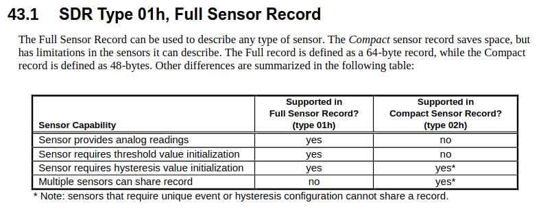

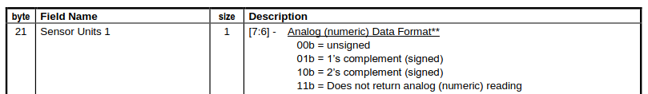

- 於MDS中，適用於Voltage這些Analog類型的組件（範例圖中組件為TEMP_MB）

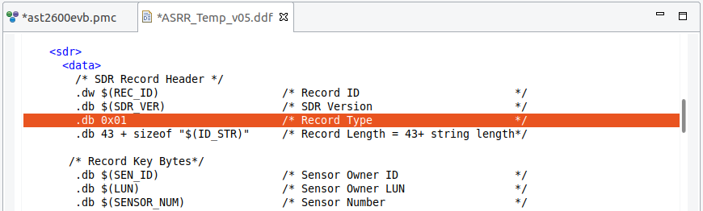

### SDR Type 02h, Compact Sensor Record

- 規範內提到Sensor provides analog readings為no，即代表Type 01h是不支援Analog的
- MDS中，適用於status這些Discrete類型的組件（範例圖中組件為STS_PSU1）

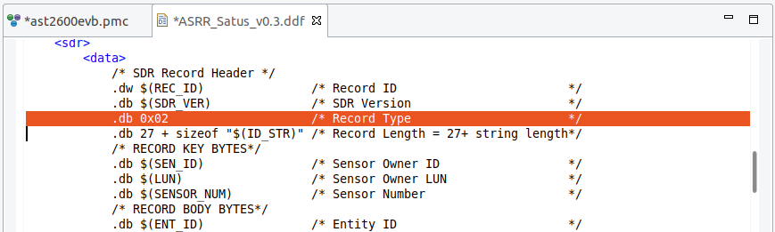

### SDR Type 03h, Event-Only Record

- 事件專用型，僅發送通知，不支援狀態讀取
    - 於MDS中，適用於Event型態（範例圖中組件為DRAM ECC Error A1）

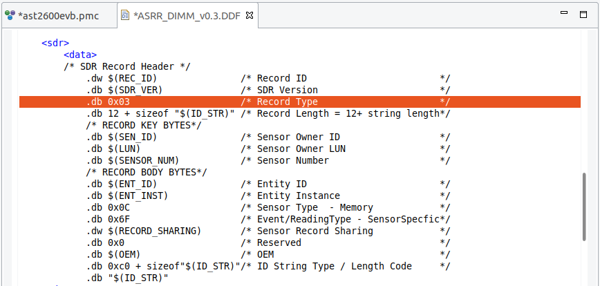

## SDR Formats

- 一般SDR的資料主要由三個形式組成

### RECORD HEADER

- Record ID : 存放SDR的值
- SDR Version : SDR規範的版本號，通常為51h
- Record Type : 紀錄SDR的類型，01h通常為Analog，02h為Discrete，03h為Event
- Record Length : 紀錄長度欄後，還有多少Bytes的數量


### RECORD 'KEY' FIELDS

- Sensor Owner ID : Slave Address 或 System Software ID
- Sensor Owner LUN : 邏輯單元編號
- Sensor Number : 感測器在該控制器下的唯一編號


### RECORD BODY

- Entity ID 與 Instance : 關聯的物理實體（如處理器、電源供應器）
- Sensor Capabilities : 感測器的功能（如是否支援自動重設、滯後量支援、門檻值存取權限）
- Sensor Type 與 Event Type Code : 感測器的分類（如溫度、電壓）與其產生的事件類型
- Sensor Units : 數據的單位格式（如攝氏度、伏特、數據編碼方式）
- Conversion Factors (轉換係數) : M、B、R exp、B exp 等用於將類比原始值轉換為單位值的係數
- Thresholds 與 Hysteresis : 預設的門檻值與滯後量設定
- ID String : 感測器的文字名稱描述


## Sensor List

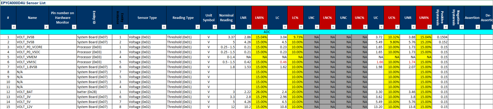

- Lower Non Recoverable : 代表數值過低，且系統硬體可能已經面臨損壞，無法恢復正常
- Lower Critical : 代表數值偏低，通常視為故障
- Lower Non Critical : 代表數值低於正常值，通常視為警告
- Upper Non Critical : 代表數值高於正常值，通常視為警告
- Upper Critical : 代表數值偏高，通常視為故障
- Upper Non Recoverable : 代表數值過高，且系統硬體可能已經面臨損壞，無法恢復正常

<a id = "formula"></a>
### Sensor Reading Conversion Formula

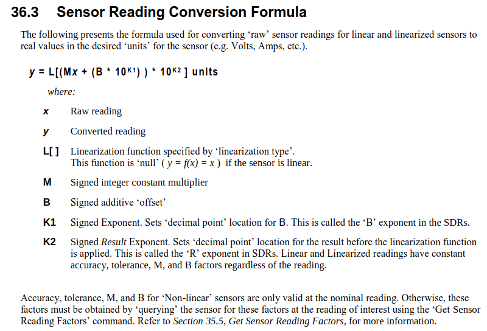

- M : 整數常數乘法
- B : Offset
- K1 : 表示B的值可以到小數點後第幾位
- K2 : 表示Result的值可以到小數點後幾位

### Example

- 範例參考VOLT_BAT，透過Sensor List可看到UNR設定為3.46，當X（raw value）為最大值（0xff = 255）時，計算M、B、K1、K2的數值需為多少才能大於UNR
    1. 3.46 < (M * 255 + (Offset * 10^K1)) * 10^K2，因數值不需要透過Offset，故B和K1都填0
    2. 3.46 < M * 255 * 10^K2，故M = 2，K2 = -2
        - 3.46 < 5.1
    3. 由上式可得知，M = 2, B = 0, K1 = 0, K2 = -2

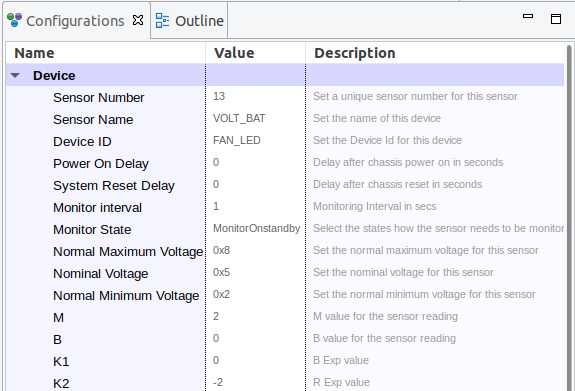

- 範例參考VOLT_12V，透過Sensor List可看到UNR設定為13.8，當X（raw value）為最大值（0xff = 255）時，計算M、B、K1、K2的數值需為多少才能大於UNR
    1. 13.8 < (M * 255 + (Offset * 10^K1)) * 10^K2，因數值不需要透過Offset，故B和K1都填0
    2. 13.8 < M * 255 * 10^K2，故M = 1，K2 = -1
        - 13.8 < 25.5
    3. 由上式可得知，M = 1, B = 0, K1 = 0, K2 = -1

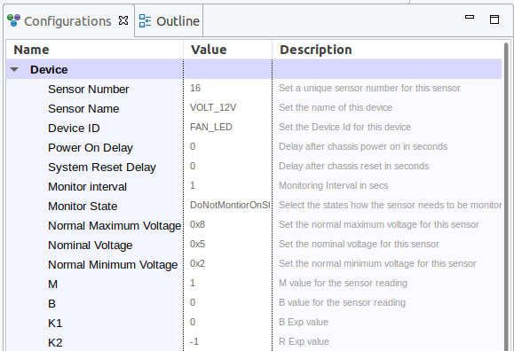

### 分壓計算

- 透過MDS查看VOLT_12V的Configuration

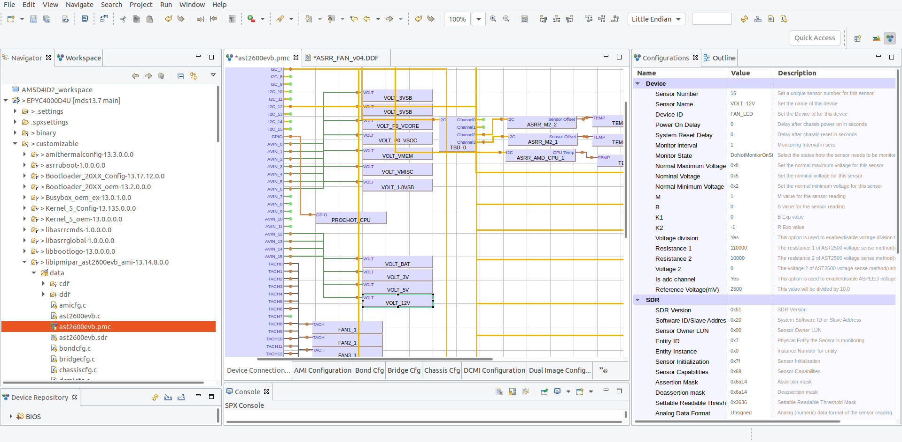

- 查看X600D4U-1N layout

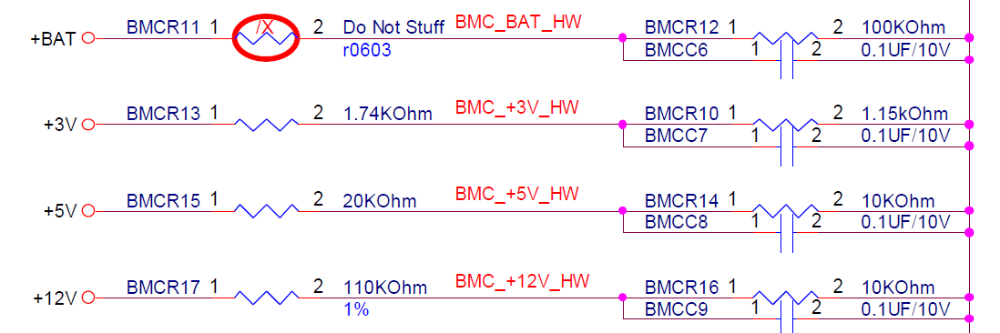

- 根據layout，+12V的路徑上連接了110KOhm和10KOhm的電阻
    - Resistance的欄位填上110K和10K
    - Voltage 2通常接地，欄位填0
    - Is adc channel欄位填Yes
    - Reference Voltage(mV) typical 2500，若M、B、K1、K2設定後讀值有異常，才會需要變更此欄位

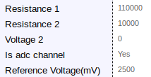

- 使用adcapp cmd查看ADC Channel的數值

```
adcapp --read-adc-channel
```

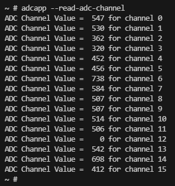

- 根據MDS接線圖可知，要查看的VOLT_12V為AVIN_15，所以對照adcapp的Channel 15，透過分壓公式計算出是否和adcapp讀取的值相近

※若比對結果超過5%，則須調整Reference Voltage

- 分壓公式

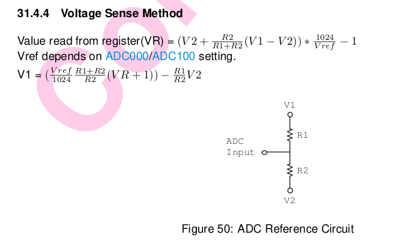

$$ (V2 + \frac{R2}{R1+R2}(V1-V2)) * \frac{1024}{V_{ref}} - 1 $$

- 將數值代入計算，比對後差異約0.98%

```
ADCin = ((V2+(R2/(R1+R2))(V1-V2))(1024/Vref))-1
=> ((0+(10000/(110000+10000))(12-0))(1024/2.5))-1 = 408.6
```

### 補充1 : 將ADCin的數值回推至VOLT_12V電壓

- 根據MDS中，VOLT_12V的公式如下

```
phal->pword[0] = ((((value + 1) * ($(REF_VOL) / 1000.0) /1024 * ($(R1) + $(R2)) / $(R2)) - (($(R1) / $(R2) * ($(V2)))) - ($(B) * pow(10, $(K1)) * pow(10, $(K2)))) / ($(M) * pow(10, $(K2)));
```

- 將參數代回公式即可回推VOLT_12V輸入電壓
	- value = 408.6
	- REF_VOL = 2500
	- R1 = 110000
	- R2 = 10000
	- V2 = 0
	- M = 1
	- B = 0
	- K1 = 0
	- K2 = -1

- 計算後可得phal->pword[0] = 120，由於K2 = -1，所以輸入電壓為12.0V

### 補充2 : 讀取layout上無R2配置的電壓(+1.8VSB、VDD_MISC_RUN)

- +1.8VSB在MDS的.pmc檔內，被定義為channel 6，VDD_MISC_RUN則定義為channel 5
- 透過adcapp讀取出 : channel 6的Vadc為738，channel 5的Vadc為456
- 套用下面公式可回推出Vin數值

```
Vin = (Vref * (Vadc + 1)) / 1024
```

- 將數值代入後，可得channel 6的輸入電壓為1.8V，channel 5的輸入電壓為1.1V

## Task#1 在MDS內修改Sensor threshold

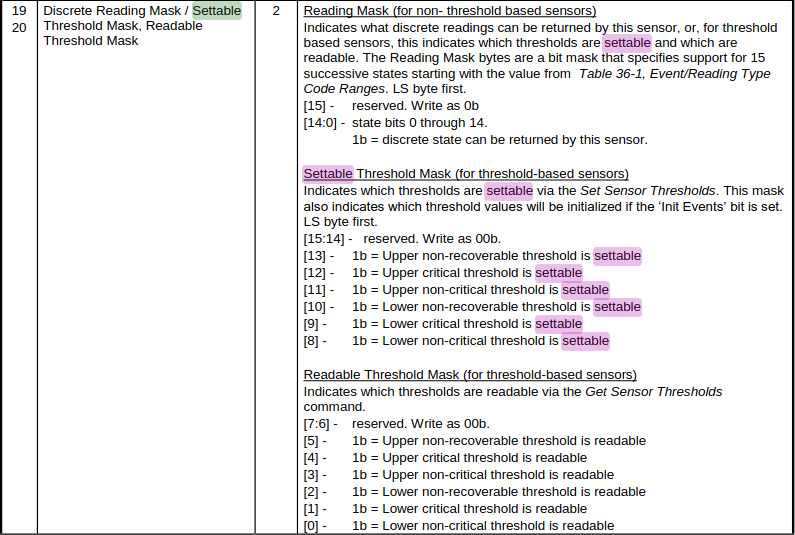

1. Settable Readable Threshold Mask的Settable bit和對應的Readable bit要確認是否Enable，MDS Configuration上才會顯示threshlod : 0x3f3f（代表所有threshold皆設置）

- 由於目前專案設置為0x3636，即代表無設置LNC及UNC

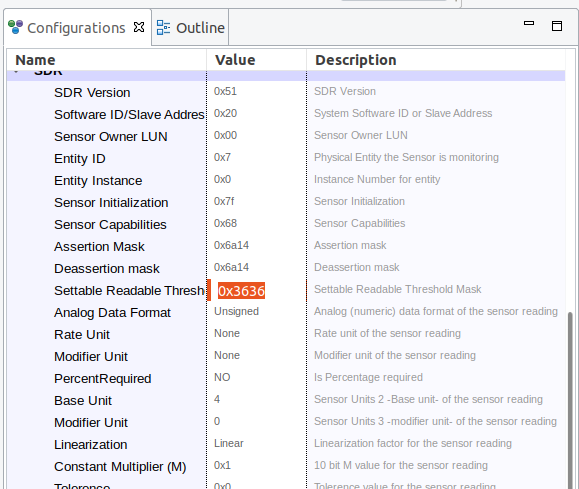

2. 設定完threshold後，點擊MDS視窗右上角的Refresh及剩餘的三個Generate code按鈕

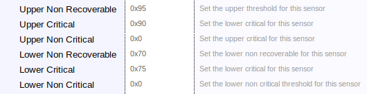

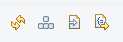

3. 編譯完後進行燒錄

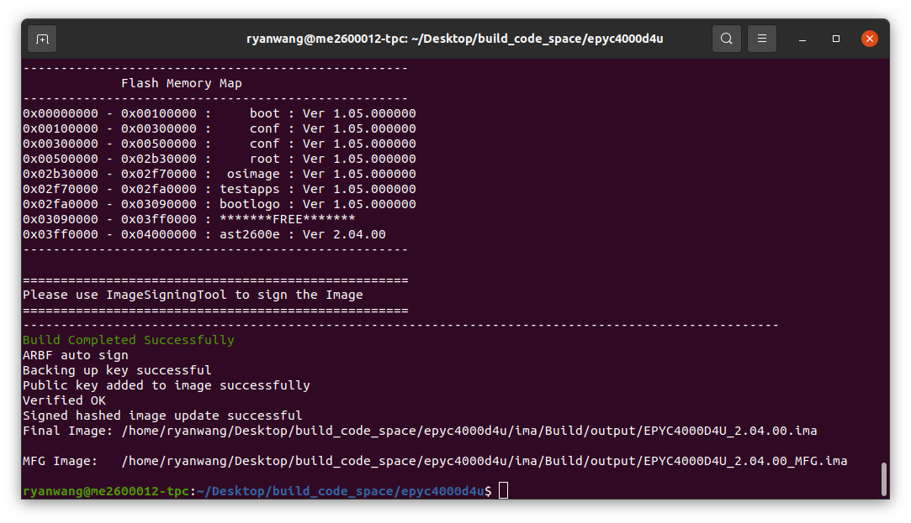

4. 確認是否成功修正

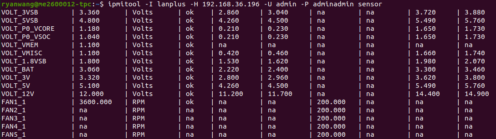


### 使用IPMI tool修改sensor threshold

- 可不透過MDS的方式，修改sensor threshold，使用ipmitool的set sensor threshold / get sensor threshold command進行修改

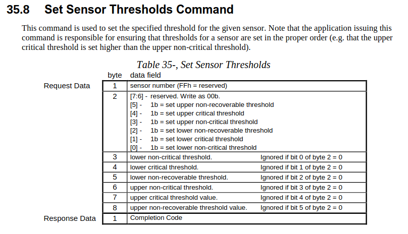

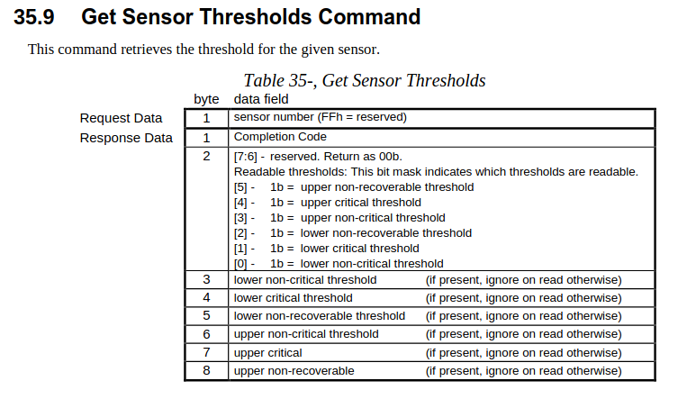

1. 透過ipmitool的get sensor threshold指令確認目前設定值

※ 可使用sdr elist command查看欲修改的sensor編號

```
ipmitool -H [HostName] -U [UserName] -P [Password] raw 0x04 0x27 [Sensor Number]
```

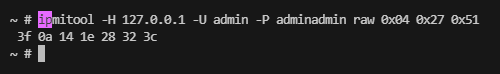

2. 發送ipmitool的set sensor threshold指令設定各個threshold數值

```
ipmitool -H [HostName] -U [UserName] -P [Password] raw 0x04 0x26 [Sensor Number]
```

- data : 0x3f 0x1e 0x1e 0x0a 0x28 0x32 0x3c
    - 0x3f : Readable threshold
        - [5] : upper non-recoverable threshold
        - [4] : upper critical threshold
        - [3] : upper non-critical threshold
        - [2] : lower non-recoverable threshold
        - [1] : lower critical threshold
        - [0] : lower non-critical threshold
    - 0x1e : lower non-critical threshold
    - 0x1e : lower critical threshold
    - 0x0a : lower non-recoverable threshold
    - 0x28 : upper non-critical threshold
    - 0x32 : upper critical threshold
    - 0x3c : upper non-recoverable threshold

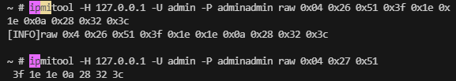

3. 透過Warm Reset，則會恢復改動前


## Task#2 Assertion / Deassertion Mask

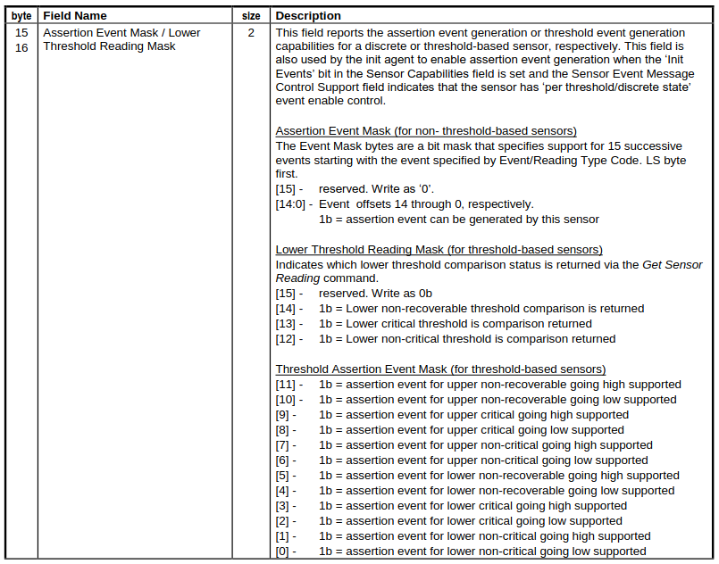

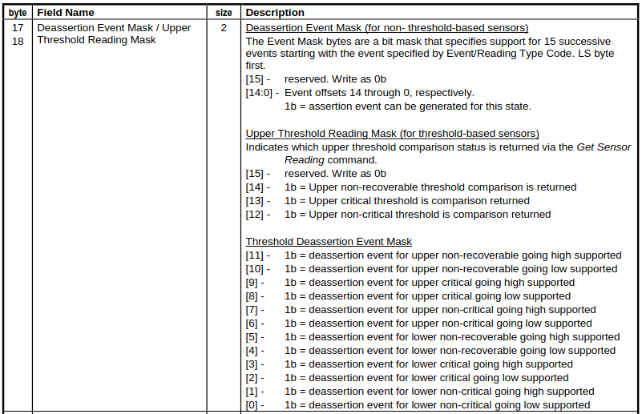

### 補充

- going high及going low使用時機
	- 若欲填寫的感測器性質為超過Threshold後才發送警告，則設為going high，例如溫度
	- 反之，若要設定的感測器性質為低於Threshold後才發送警告，則設為going low，例如風扇轉速


---

1. 開啟event mask與reading mask；溫度上升/下降皆會觸發事件，建議值為0x7A95

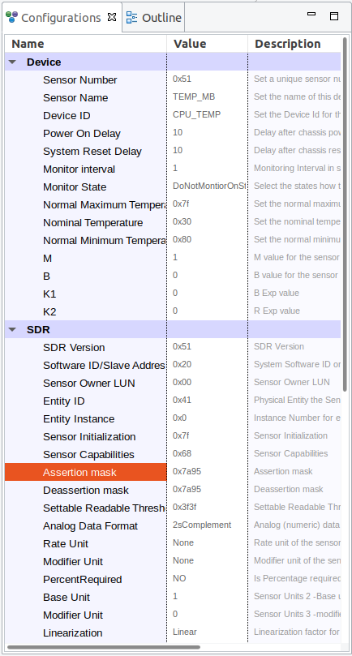

2. 利用內網查詢ASRR OEM指令CMD_ASRR_THERMAL_TEST_SET_CONF控制TEMP_MB讀值

```
ipmitool -H [HostName] -U [UserName] -P [Password] raw 0x3a 0xe3 0x90 [OVERRIDE_SENSOR_YES] [Sensor Number] [Sensor Reading] [ReqLen]
```

- 設定觸發going-high，數值設為100

```
ipmitool -H [HostName] -U [UserName] -P [Password] raw 0x3a 0xe3 0x90 1 0x51 100 3
```


- 設定觸發going-low，數值設為0

```
ipmitool -H [HostName] -U [UserName] -P [Password] raw 0x3a 0xe3 0x90 1 0x51 0 3
```


## Task#3 Sensor Reading Conversion

- 在MDS中調整TEMP_MB的M、B、K1、K2參數，使其數值變為10倍
- 透過Get Sensor Reading Factors和sensor指令驗證設定避免raw data overflow

1. 根據[Sensor Reading Conversion Formula](#formula)調整參數

- 設M = 10(0x0A)，等同於Constant Multiplier = 0x0a，將x放大10倍

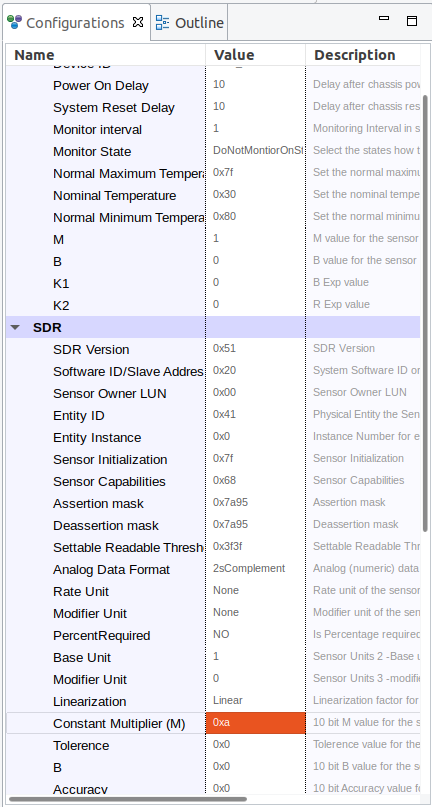

2. 發送Get Sensor Reading Command驗證

```
ipmitool -H [HostName] -U [UserName] -P [Password] raw 0x04 0x23 0x51 0x07
```

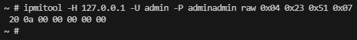

3. 查看修改結果

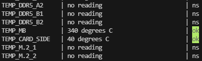

### Device M和SDR M差異

- 透過Get Sensor Reading的指令讀取raw data

```
ipmitool -H [HostName] -U [UserName] -P [Password] raw 0x04 0x2d 0x51
```

- 僅修改SDR M，raw data值不變，讀值改變


- 僅修改Device M，raw data值和讀值皆改變

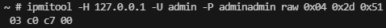


- 從測試結果可以得知，Device M影響在.ddf內計算的M值，SDR M影響raw data轉換的部份
- 實作上兩個參數需要一致，才不會造成raw data和讀值出現誤差

※修改SDR M以及Device M後讀取的數值，皆會在Web上呈現

## Task#4 NCT6796D DDF與新TEMP Sensor建置

- 在MDS內複製NCT6796D DDF，新增一個自訂Output Pin，此pin要來讀取TEMP_FCH、TEMP_MB、TEMP_CARD_SIDE的總和
- 於.pmc中導入新元件、建立額外的TEMP Sensor，調整讀值避免overflow

1. 於DDF目錄複製既有NCT6796D DDF，同步更新檔名與name tag（兩者必須一致）

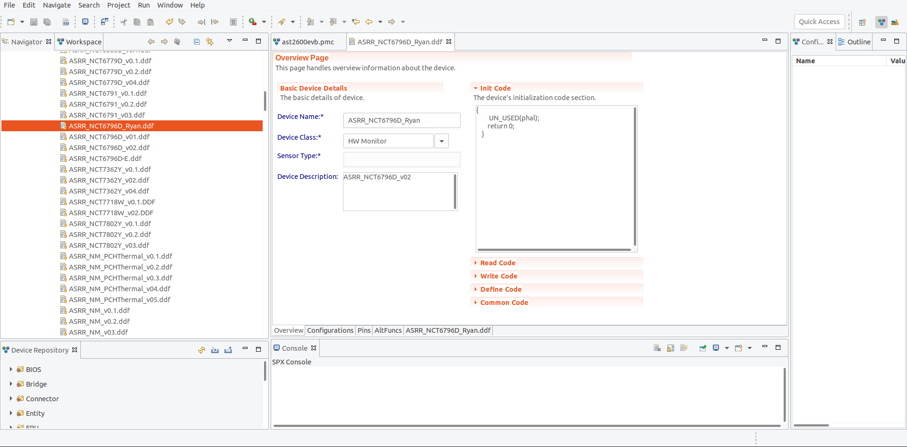

2. 在Pins標籤頁面新增一個Output Pin
※由於新增的是溫度感測器，output pin必須是therm_S才可以與sensor連接

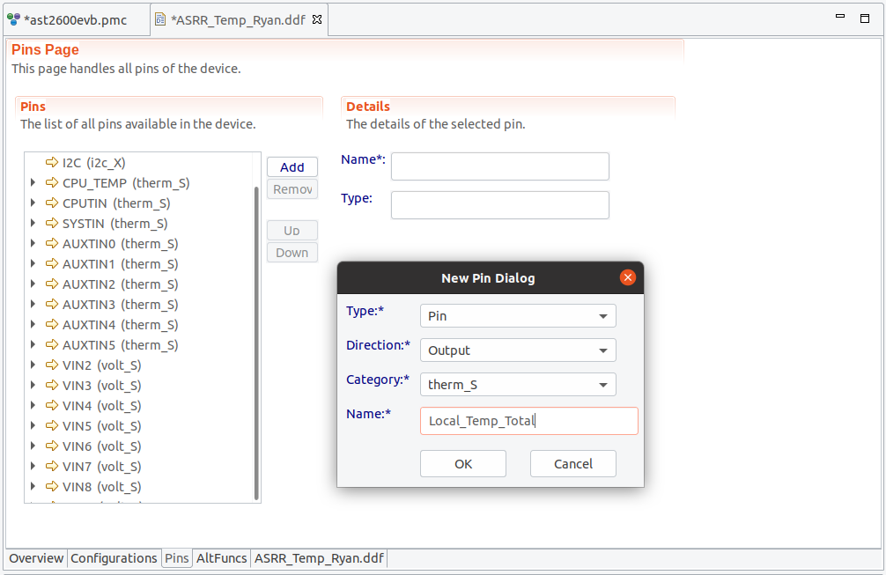

3. 於程式撰寫區塊新增讀值/轉換邏輯

```
uint16 systin_temp = 0;
uint16 auxtin5_temp = 0;

$(this).semwait($(I2C_SEMAPHORE));

phal->write_len = 2;
phal->i2c.reg_num = 0x4e;	// Bank selector
phal->pwrite_buf[0] = 0x04;
$(this).writereg(phal);     // Set to Bank 4

phal->i2c.reg_num = 0x90;	// SYSTIN Register
phal->read_len = 1;
$(this).readreg(phal);
systin_temp = phal->pbyte[0];

phal->i2c.reg_num = 0xa2;	// AUXTIN5 Register
phal->read_len = 1;
$(this).readreg(phal);
auxtin5_temp = phal->pbyte[0];

$(this).sempost($(I2C_SEMAPHORE));

phal->pword[0] = systin_temp + auxtin5_temp;

return 0;
```

- 變數初始化，定義兩個變數來暫存output pin數值

```
uint16 systin_temp = 0;
uint16 auxtin5_temp = 0;
```

- 由於systin和auxtin5都在BANK 4內，要先切換到Bank 4

```
phal->write_len = 2;
phal->i2c.reg_num = 0x4e;	// Bank selector
phal->pwrite_buf[0] = 0x04;
$(this).writereg(phal);     // Set to Bank 4
```

- 將暫存器內的值讀取出來

```
phal->i2c.reg_num = 0x90;	// SYSTIN Register
phal->read_len = 1;
$(this).readreg(phal);
systin_temp = phal->pbyte[0];

phal->i2c.reg_num = 0xa2;	// AUXTIN5 Register
phal->read_len = 1;
$(this).readreg(phal);
auxtin5_temp = phal->pbyte[0];
```

- 最後，將數值相加

```
phal->pword[0] = systin_temp + auxtin5_temp;
```

4. 回到MDS畫面，找到畫面左下角的Device Repository -> HW Monitor，將新增的元件拖曳進.pmc
※若在HW Monitor畫面找不到新增的元件，可點選Refresh刷新

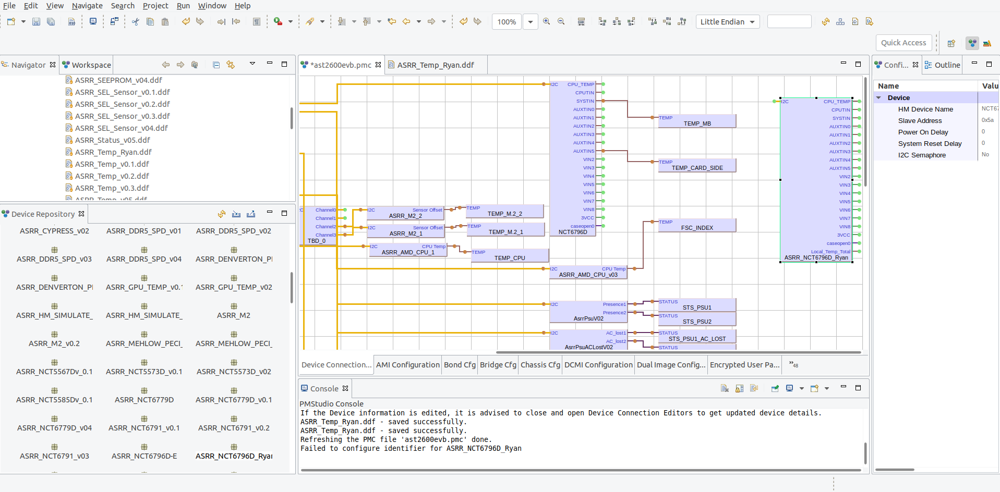

5. 用相同方式複製TEMP sensor的DDF，更新檔名及name tag

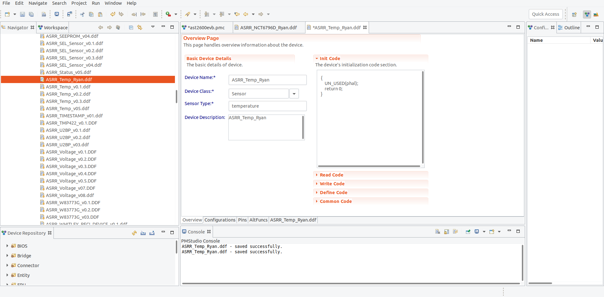

6. 將其加入.pmc

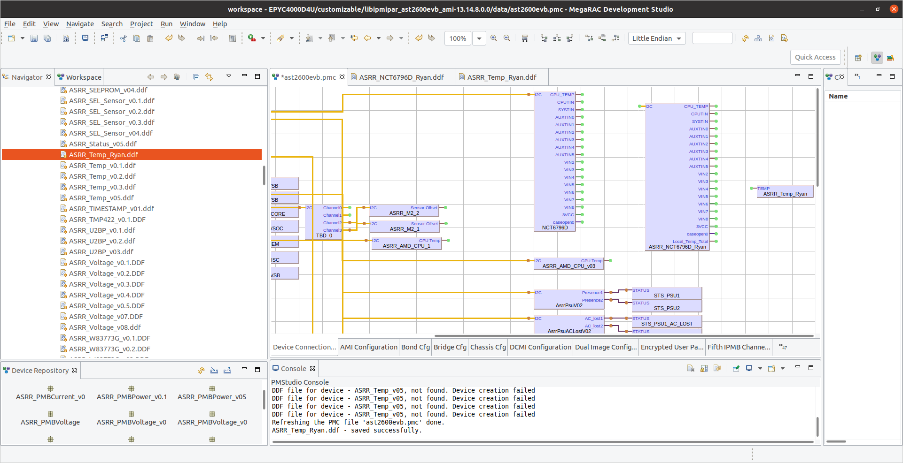

7. 選擇未被使用的Sensor Number，避免Refresh PMC時衝突導致元件消失

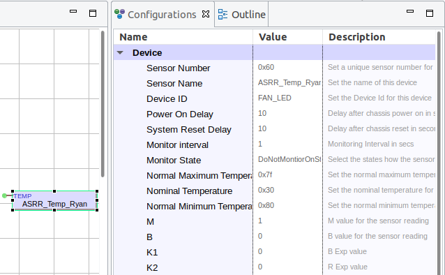

8. 因溫度來源加總可能超過8bit最大值255，必須在新sensor的read() function內，調整M，確保其工程值可對應於0~255

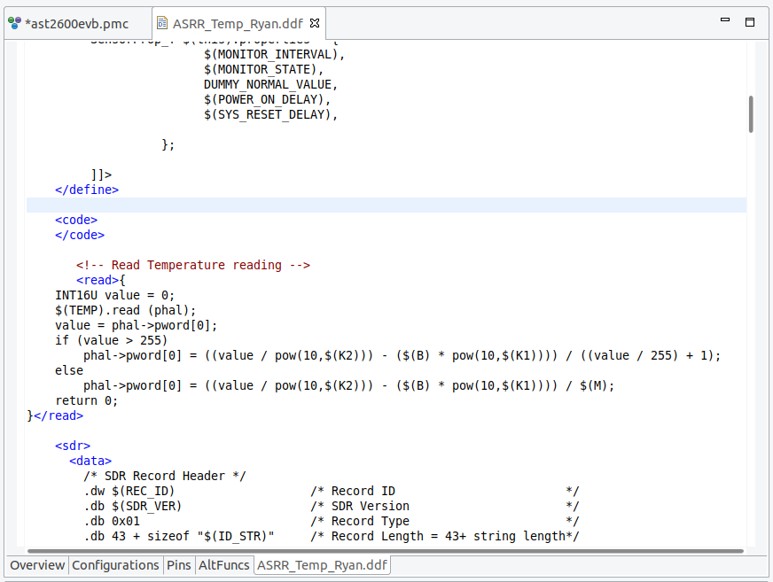

```
if (value > 255)
    phal->pword[0] = ((value / pow(10,$(K2))) - ($(B) * pow(10,$(K1)))) / ((value / 255) + 1);
else
    phal->pword[0] = ((value / pow(10,$(K2))) - ($(B) * pow(10,$(K1)))) / $(M);
```

9. 將所有的元件線路連接，確認.pmc內路徑正確

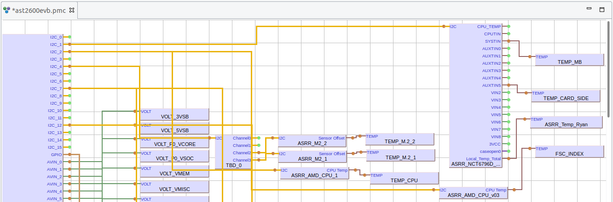

10. 透過web端確認Dashboard與Sensor Reading頁皆可看到新感測器資料

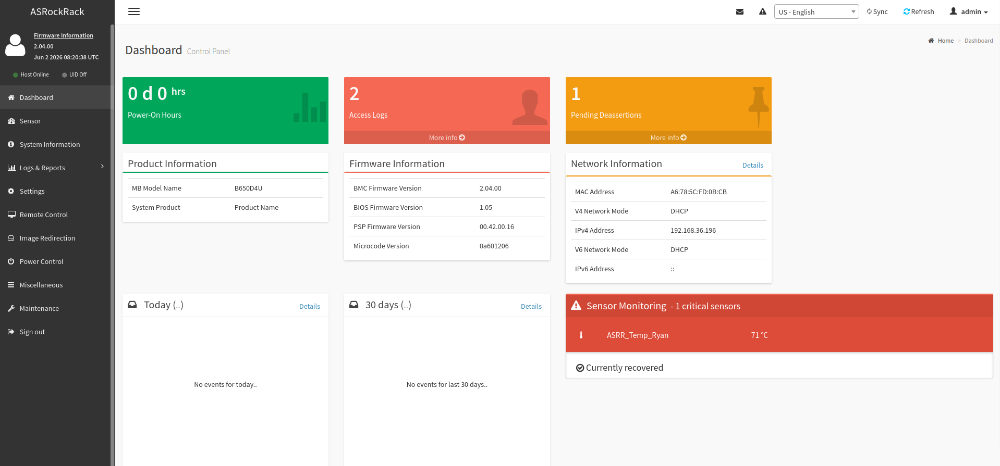

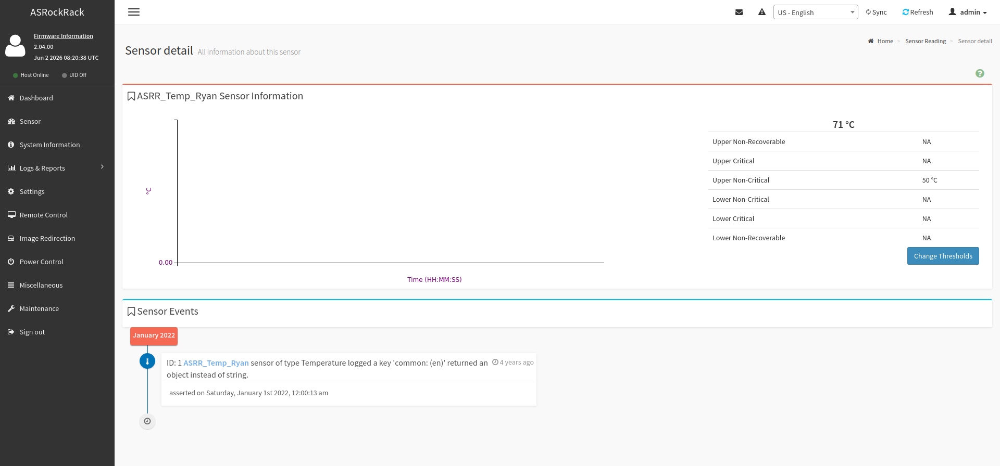

11. 也可以透過ipmi command看到建立的sensor


## Task#5 PDKSensor.c實作TEMP Sensor加總

- 延續Task 4，不修改DDF，而是使用PDKSensor.c調整輸出

1. 將MDS內相關Sensor的M/B/K1/K2，還原成預設的1/0/0/0
    - 將Task 4在DDF中添加的程式碼移除，避免重複計算

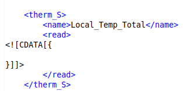

2. 在asrrglobal.h建立一個變數，用來儲存溫度感測值和溫度加總

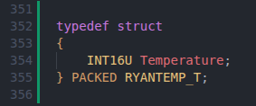

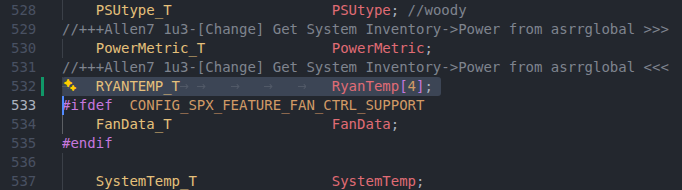

3. PDKSensor.h中建立TEMP_RYAN的pre/post function

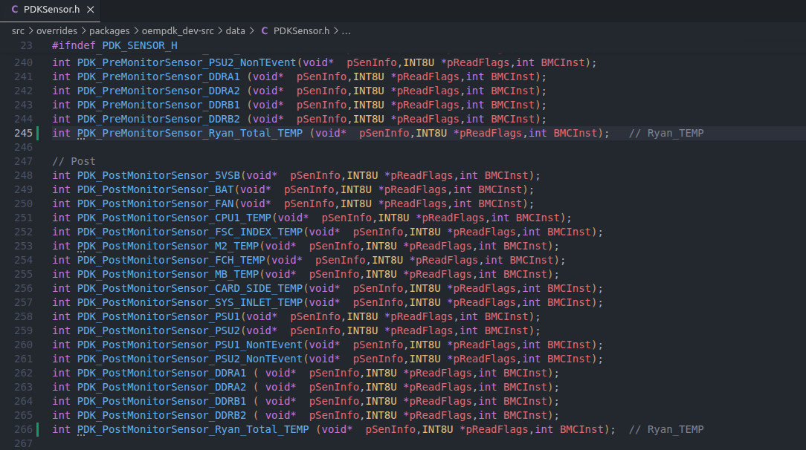

4. PDKSensor.h中定義TEMP_RYAN的Sensor number需要跟MDS裡的一致

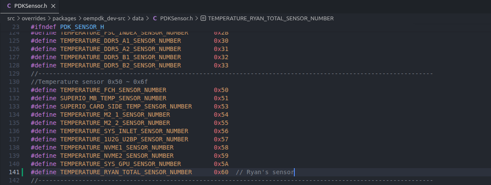

5. PDKSensor.c中將在.h檔宣告的function link起來

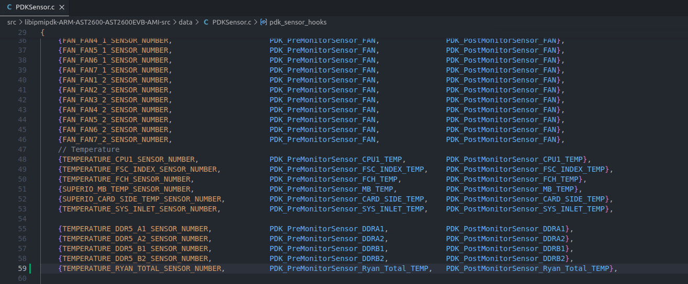

6. PDKSensor.c中，撰寫PreMonitorSensor Function和PostMonitorSensor Function

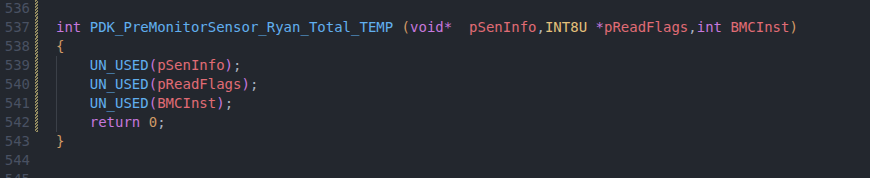

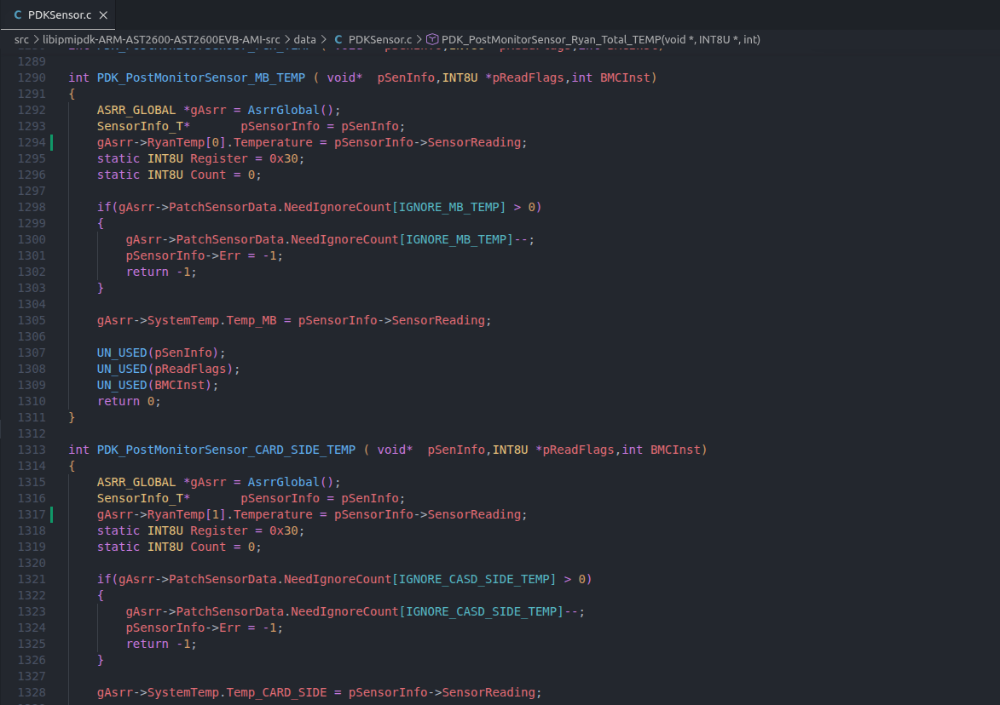

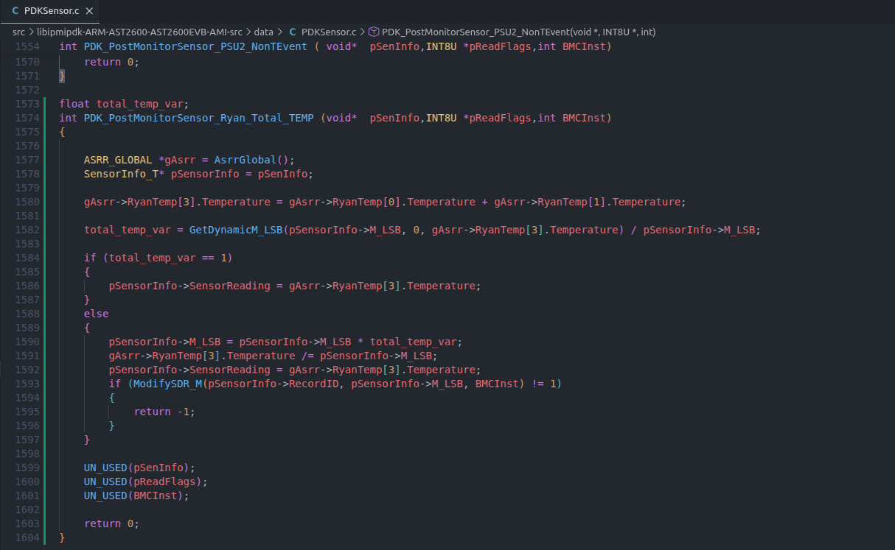

```
float total_temp_var;
int PDK_PostMonitorSensor_Ryan_Total_TEMP (void*  pSenInfo,INT8U *pReadFlags,int BMCInst)
{

	ASRR_GLOBAL *gAsrr = AsrrGlobal();
	SensorInfo_T* pSensorInfo = pSenInfo;

	gAsrr->RyanTemp[3].Temperature = gAsrr->RyanTemp[0].Temperature + gAsrr->RyanTemp[1].Temperature;

	total_temp_var = GetDynamicM_LSB(pSensorInfo->M_LSB, 0, gAsrr->RyanTemp[3].Temperature) / pSensorInfo->M_LSB;

	if (total_temp_var == 1)
	{
		pSensorInfo->SensorReading = gAsrr->RyanTemp[3].Temperature;
	}
	else
	{
		pSensorInfo->M_LSB = pSensorInfo->M_LSB * total_temp_var;
		gAsrr->RyanTemp[3].Temperature /= pSensorInfo->M_LSB;
		pSensorInfo->SensorReading = gAsrr->RyanTemp[3].Temperature;
		if (ModifySDR_M(pSensorInfo->RecordID, pSensorInfo->M_LSB, BMCInst) != 1)
		{
			return -1;
		}
	}

	UN_USED(pSenInfo);
	UN_USED(pReadFlags);
	UN_USED(BMCInst);

	return 0;
}
```

- 使用GetDynamicM_LSB()取得新的M，算出新M與舊M的倍率
- 若倍率為1，則不進行更新，若倍率不為1，則算出新的值並更新SDR M
- 使用此方式可避免頻繁寫入Flash，導致Flash讀/寫壽命縮短

7. 透過ipmitool command查看ASRR_Temp_Ryan，確認是否有顯示加總後的溫度

- TEMP_MB = 33 degrees C
- TEMP_CARD_SIDE = 38 degrees C
- ASRR_Temp_Ryan = (33+38) = 71 degrees C


## Task#6 Web Setting新增Ryan TEMP頁面

- 在Setting頁面新增按鈕，點擊後可查看TEMP_MB/TEMP_CARD_SIDE/TEMP_Ryan的資訊
- 建立i18n、前端模板/model/view、RouterExt註冊與REST handler，讓頁面可讀取後端資料

1. 在settings.html新增一個按鈕

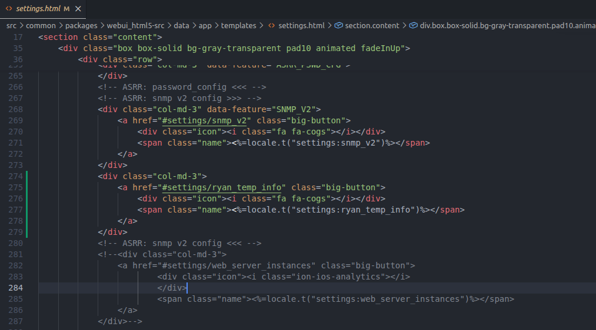

2. 設定不同語系介面的按鈕

- 英語

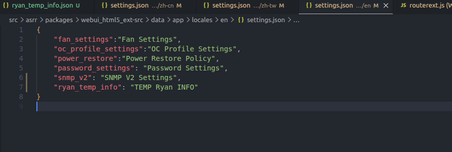

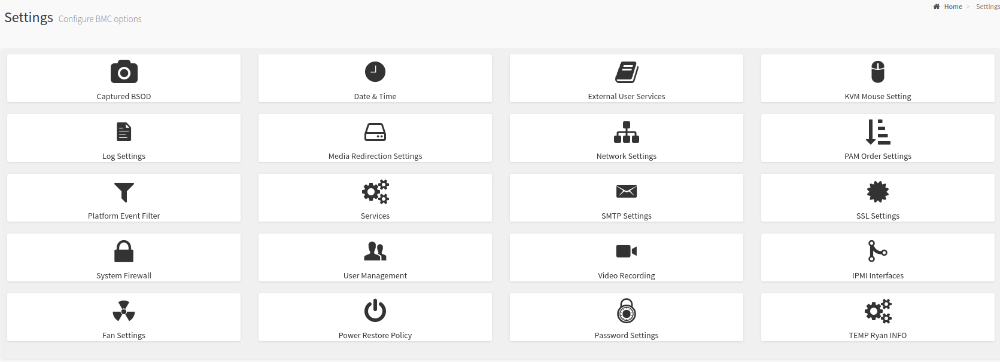

- 繁體中文

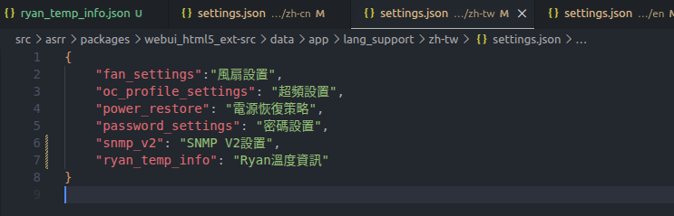


- 簡體中文

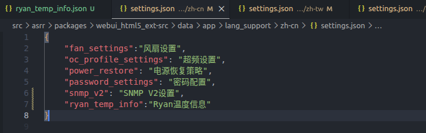

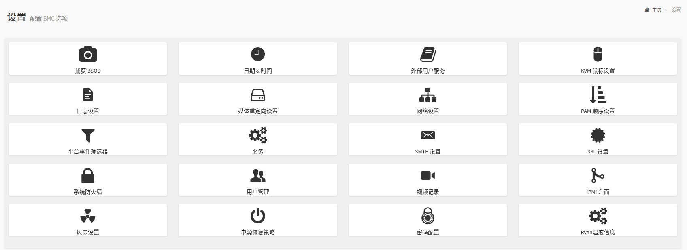

3. 在templates/settings建立temp_info.html新增按鈕對應的模板，建立按鈕對應的網頁內容

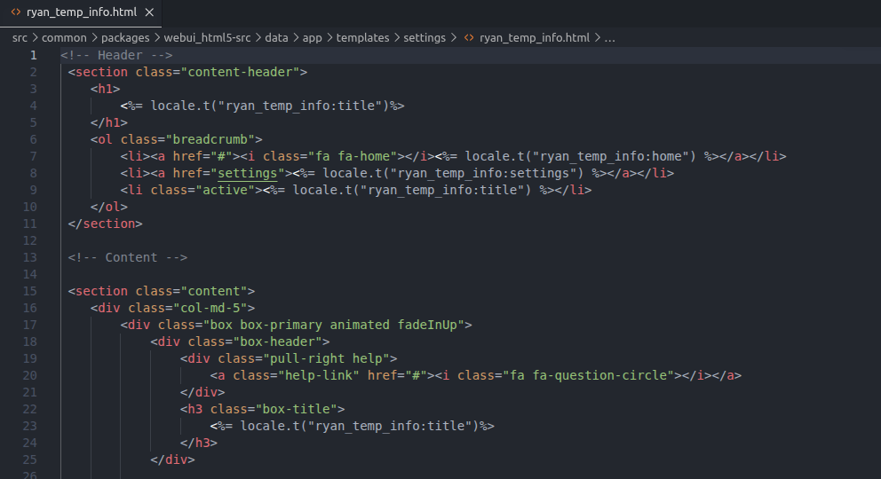

```
<!-- Header -->
 <section class="content-header">
    <h1>
        <%= locale.t("ryan_temp_info:title")%>
    </h1>
    <ol class="breadcrumb">
        <li><a href="#"><i class="fa fa-home"></i><%= locale.t("ryan_temp_info:home") %></a></li>
        <li><a href="settings"><%= locale.t("ryan_temp_info:settings") %></a></li>
        <li class="active"><%= locale.t("ryan_temp_info:title") %></li>
    </ol>
 </section>

 <!-- Content -->

 <section class="content">
    <div class="col-md-5">
        <div class="box box-primary animated fadeInUp">
            <div class="box-header">
                <div class="pull-right help">
                    <a class="help-link" href="#"><i class="fa fa-question-circle"></i></a>
                </div>
                <h3 class="box-title">
                    <%= locale.t("ryan_temp_info:title")%>
                </h3>
            </div>

            <div class="box-body">
                <div class="alert alert-success hide">
                    <i><%= locale.t("ryan_temp_info:strongSuccessMsg")%></i>
                </div>
                <div class="alert alert-danger hide">
                    <i><%= locale.t("ryan_temp_info:strongFailureMsg")%></i>
                </div>

                <form action="javascript://" method="POST" role="form">
                    <!-- Current MB Temperature -->
                    <div class="form-group">
                        <div class="alert alert-info help-item hide" role="alert">
                            <%= locale.t("ryan_temp_info:Current_MB_temperature_help") %>
                        </div>
                        <label for="current_MB_temperature">
                            <%= locale.t("ryan_temp_info:Current_MB_temperature") %>
                        </label>
                        <input type="text"
                                class="form-control"
                                id="current_MB_temperature"
                                value=""
                                placeholder=""
                                disabled="disabled">
                    </div>
                    <!-- Current SIDE Temperature -->
                    <div class="form-group">
                        <div class="alert alert-info help-item hide" role="alert">
                            <%= locale.t("ryan_temp_info:Current_SIDE_temperature_help") %>
                        </div>
                        <label for="current_SIDE_temperature">
                            <%= locale.t("ryan_temp_info:Current_SIDE_temperature") %>
                        </label>
                        <input type="text"
                                class="form-control"
                                id="current_SIDE_temperature"
                                value=""
                                placeholder=""
                                disabled="disabled">
                    </div>
                    <!-- Current Ryan Temperature -->
                    <div class="form-group">
                        <div class="alert alert-info help-item hide" role="alert">
                            <%= locale.t("ryan_temp_info:Current_ryan_temperature_help") %>
                        </div>
                        <label for="current_ryan_temperature">
                            <%= locale.t("ryan_temp_info:Current_ryan_temperature") %>
                        </label>
                        <input type="text"
                                class="form-control"
                                id="current_ryan_temperature"
                                value=""
                                placeholder=""
                                disabled="disabled">
                    </div>

                    <div class="clearfix"></div>
                </form>
            </div>
        </div>
    </div>
 </section>
```

4. 在locales/en建立temp_info.json，定義網頁各欄位的名稱

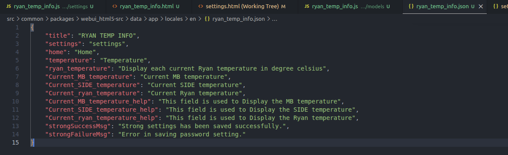

```
{
    "title": "RYAN TEMP INFO",
    "settings": "settings",
    "home": "Home",
    "temperature": "Temperature",
    "ryan_temperature": "Display each current Ryan temperature in degree celsius",
    "Current_MB_temperature": "Current MB temperature",
    "Current_SIDE_temperature": "Current SIDE temperature",
    "Current_ryan_temperature": "Current Ryan temperature",
    "Current_MB_temperature_help": "This field is used to Display the MB temperature",
    "Current_SIDE_temperature_help": "This field is used to Display the SIDE temperature",
    "Current_ryan_temperature_help": "This field is used to Display the Ryan temperature",
    "strongSuccessMsg": "Strong settings has been saved successfully.",
    "strongFailureMsg": "Error in saving password setting."
}
```

5. 在app/models建立temp_info.js

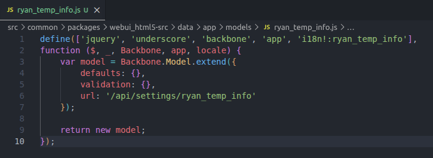

```
define(['jquery', 'underscore', 'backbone', 'app', 'i18n!:ryan_temp_info'],
function ($, _, Backbone, app, locale) {
    var model = Backbone.Model.extend({
        defaults: {},
        validation: {},
        url: '/api/settings/ryan_temp_info'
    });

    return new model;
});
```

- backbone model是前端用來管理資料驗證，並透過api與後端連接的資料物件

6. 在view/settings建立temp_info.js，讓前端網頁讀取後端的內容

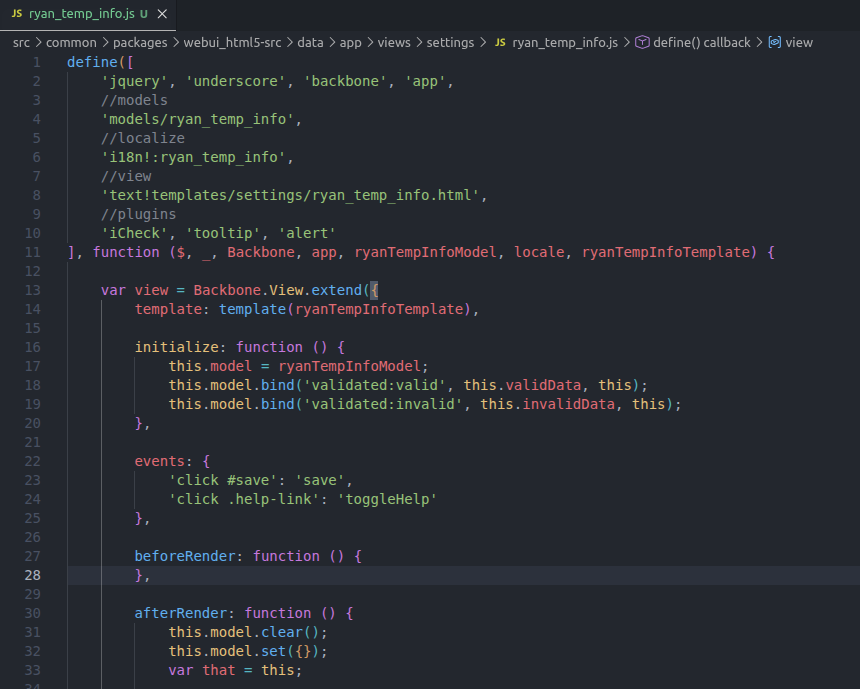

```
define([
    'jquery', 'underscore', 'backbone', 'app',
    //models
    'models/ryan_temp_info',
    //localize
    'i18n!:ryan_temp_info',
    //view
    'text!templates/settings/ryan_temp_info.html',
    //plugins
    'iCheck', 'tooltip', 'alert'
], function ($, _, Backbone, app, ryanTempInfoModel, locale, ryanTempInfoTemplate) {

    var view = Backbone.View.extend({
        template: template(ryanTempInfoTemplate),

        initialize: function () {
            this.model = ryanTempInfoModel;
            this.model.bind('validated:valid', this.validData, this);
            this.model.bind('validated:invalid', this.invalidData, this);
        },

        events: {
            'click #save': 'save',
            'click .help-link': 'toggleHelp'
        },

        beforeRender: function () {
        },

        afterRender: function () {
            this.model.clear();
            this.model.set({});
            var that = this;

            this.model.fetch({
                success: function (model) {
                    $('#current_MB_temperature')
                        .val(that.model.get('current_MB_temperature'));
                    $('#current_SIDE_temperature')
                        .val(that.model.get('current_SIDE_temperature'));
                    $('#current_ryan_temperature')
                        .val(that.model.get('current_ryan_temperature'));
                },
                failure: function () {
                    // TOBA 錯誤顯示
                }
            });
        },

        toggleHelp: function (e) {
            app.helpContentCheck(e, this);
        },

        serialize: function () {
            return {
                locale: locale
            };
        }
    });
    return view;
});
```

7. 在data建立settings_temp.c，定義後端get_handle()

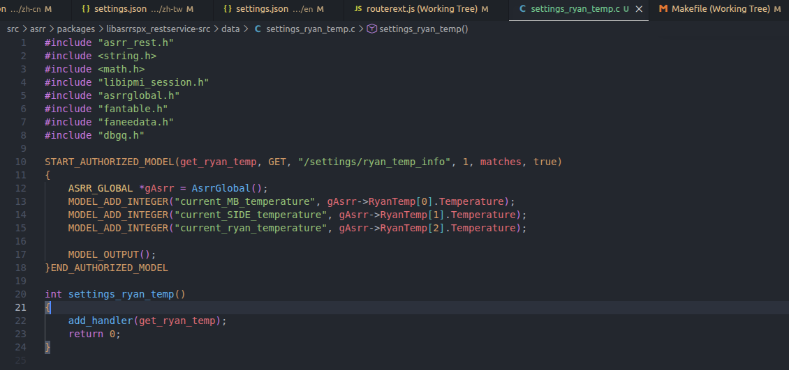

```
#include "asrr_rest.h"
#include <string.h>
#include <math.h>
#include "libipmi_session.h"
#include "asrrglobal.h"
#include "fantable.h"
#include "faneedata.h"
#include "dbgq.h"

START_AUTHORIZED_MODEL(get_ryan_temp, GET, "/settings/ryan_temp_info", 1, matches, true)
{
    ASRR_GLOBAL *gAsrr = AsrrGlobal();
    MODEL_ADD_INTEGER("current_MB_temperature", gAsrr->RyanTemp[0].Temperature);
    MODEL_ADD_INTEGER("current_SIDE_temperature", gAsrr->RyanTemp[1].Temperature);
    MODEL_ADD_INTEGER("current_ryan_temperature", gAsrr->RyanTemp[2].Temperature);

    MODEL_OUTPUT();
}END_AUTHORIZED_MODEL

int settings_ryan_temp()
{
    add_handler(get_ryan_temp);
    return 0;
}
```

8. 在asrr_rest.c和asrr_rest.h將後端的handler link到asrr的rest service

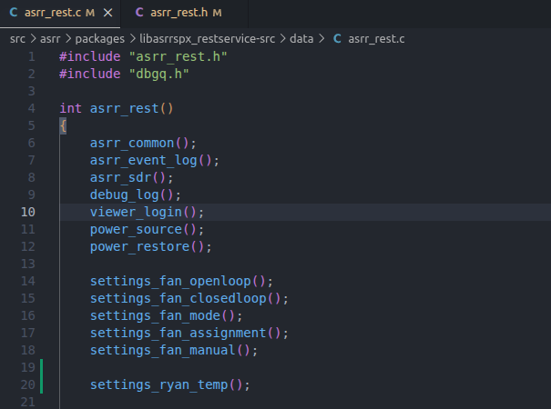

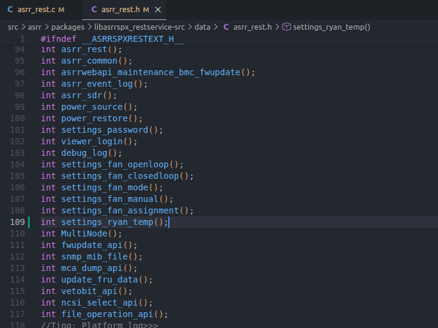

9. 將settings_temp.c加入Makefile

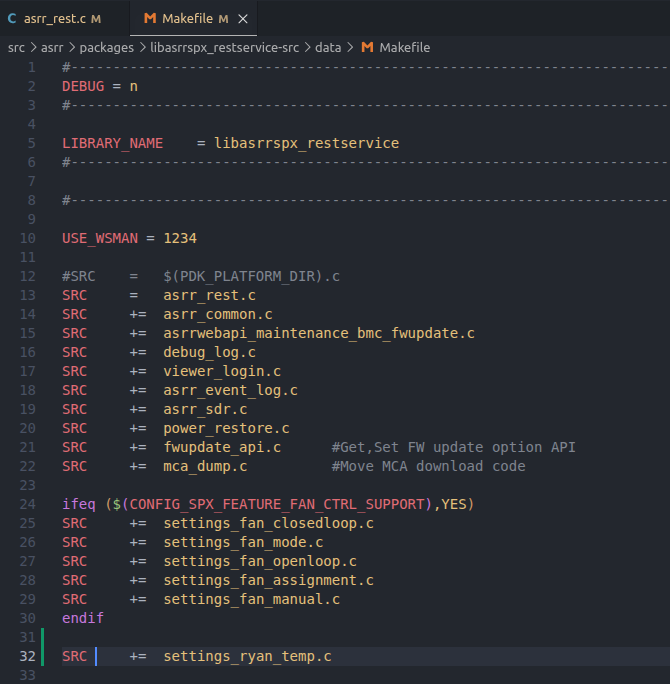

10. RouterExt設定，在data/app/routerext.js，綁定路由與頁面參數，讓按鈕導向新面板

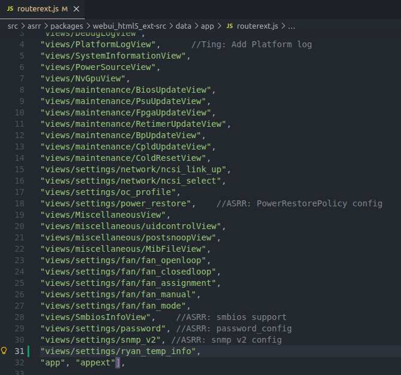

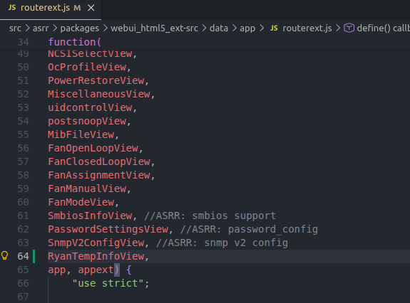

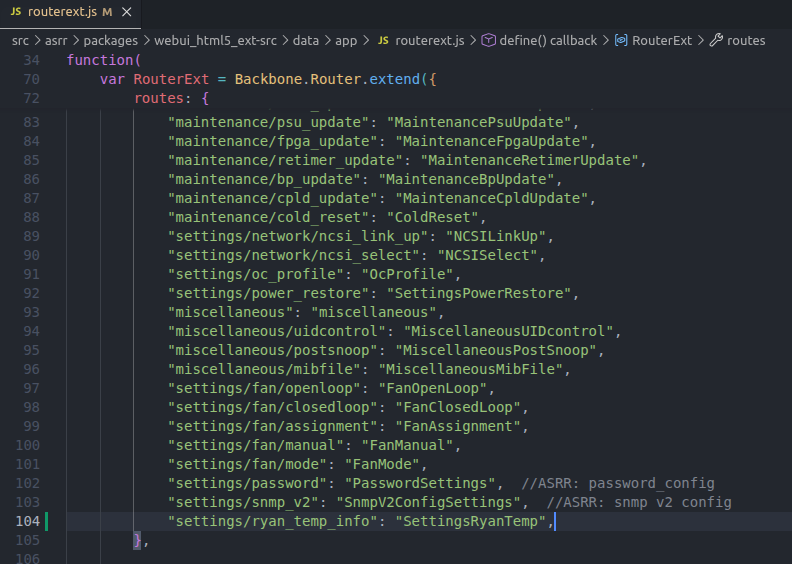

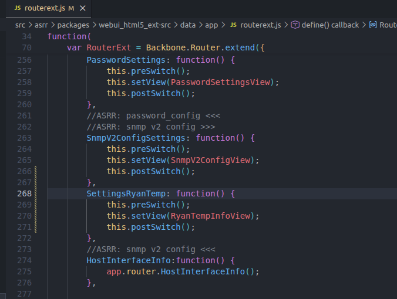

11. 編譯燒錄後，進入Settings頁面查看


### 整體流程說明

- xxx.html : 建立網頁
- /en/xxx.json : 定義語系檔欄位名稱
- /app/models/xxx.json : 前端的backbone model,定義資料怎麼存怎麼驗證，類似前端的struct，並透過api跟後端連結
- /view/settings/xxx.js : 將畫面渲染出來，綁定按鈕事件，透過model fetch/save與後端api交換資料，並處理驗證與錯誤提示
- /data/xxx.c : 後端程式碼，REST API handler

## Task#7 在Ryan TEMP頁面新增Offset欄位與Save功能

- 在頁面增加Offset輸入框與Save按鈕
    - Offset輸入限制1~100
- 透過REST set handler儲存Offset，ipmitool讀值時可反映新偏移

1. 修改ryan_temp_info.html，新增Offset欄位與Save按鈕

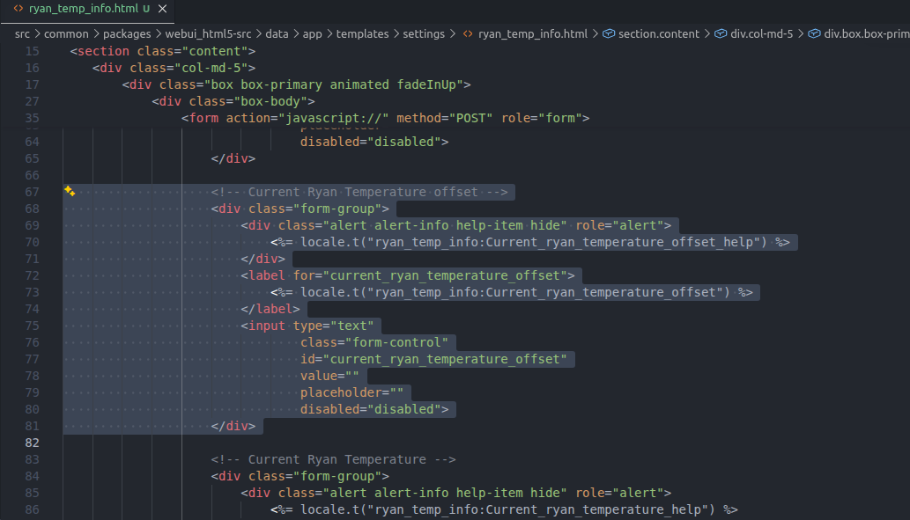

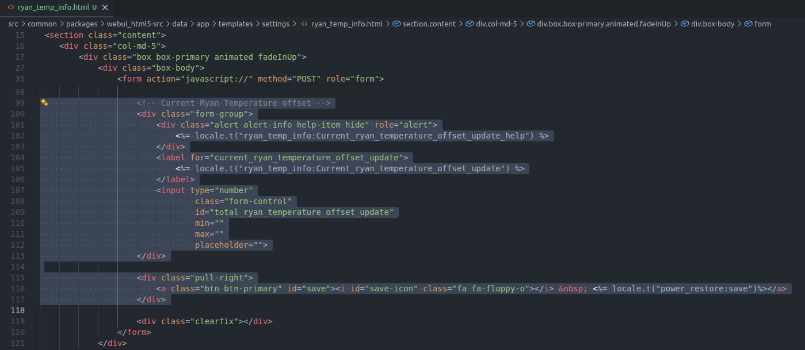

```
<!-- Current Ryan Temperature offset -->
<div class="form-group">
    <div class="alert alert-info help-item hide" role="alert">
        <%= locale.t("ryan_temp_info:Current_ryan_temperature_offset_help") %>
    </div>
    <label for="current_ryan_temperature_offset">
        <%= locale.t("ryan_temp_info:Current_ryan_temperature_offset") %>
    </label>
    <input type="text"
            class="form-control"
            id="current_ryan_temperature_offset"
            value=""
            placeholder=""
            disabled="disabled">
</div>
```

```
<!-- Current Ryan Temperature offset -->
<div class="form-group">
    <div class="alert alert-info help-item hide" role="alert">
        <%= locale.t("ryan_temp_info:Current_ryan_temperature_offset_update_help") %>
    </div>
    <label for="current_ryan_temperature_offset_update">
        <%= locale.t("ryan_temp_info:Current_ryan_temperature_offset_update") %>
    </label>
    <input type="number"
            class="form-control"
            id="total_ryan_temperature_offset_update"
            min=""
            max=""
            placeholder="">
</div>

<div class="pull-right">
    <a class="btn btn-primary" id="save"><i id="save-icon" class="fa fa-floppy-o"></i> &nbsp; <%= locale.t("power_restore:save")%></a>
</div>
```

2. 在ryan_temp_info.json內，加入Offset標籤與提示字

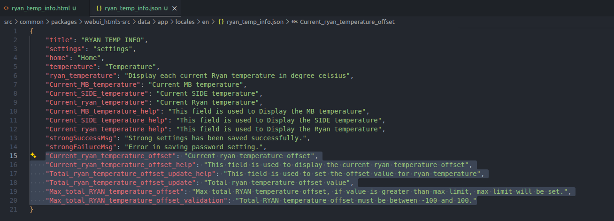

```
"Current_ryan_temperature_offset": "Current ryan temperature offset",
"Current_ryan_temperature_offset_help": "This field is used to display the current ryan temperature offset",
"Total_ryan_temperature_offset_update_help": "This field is used to set the offset value for ryan temperature",
"Total_ryan_temperature_offset_update": "Total ryan temperature offset value",
"Max_total_RYAN_temperature_offset": "Max total RYAN temperature offset, if value is greater than max limit, max limit will be set.",
"Max_total_RYAN_temperature_offset_validation": "Total RYAN temperature offset must be between -100 and 100."
```

3. 在/app/models/temp_info.js定義Offset可寫範圍為1~100，並開啟set API

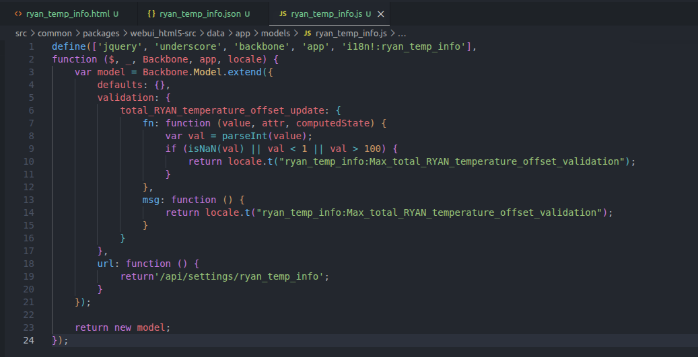

```
define(['jquery', 'underscore', 'backbone', 'app', 'i18n!:ryan_temp_info'],
function ($, _, Backbone, app, locale) {
    var model = Backbone.Model.extend({
        defaults: {},
        validation: {
            total_RYAN_temperature_offset_update: {
                fn: function (value, attr, computedState) {
                    var val = parseInt(value);
                    if (isNaN(val) || val < 1 || val > 100) {
                        return locale.t("ryan_temp_info:Max_total_RYAN_temperature_offset_validation");
                    }
                },
                msg: function () {
                    return locale.t("ryan_temp_info:Max_total_RYAN_temperature_offset_validation");
                }
            }
        },
        url: function () {
            return'/api/settings/ryan_temp_info';
        }
    });

    return new model;
});
```

4. 修改/views/settings/temp_info.js，新增save按鈕行為

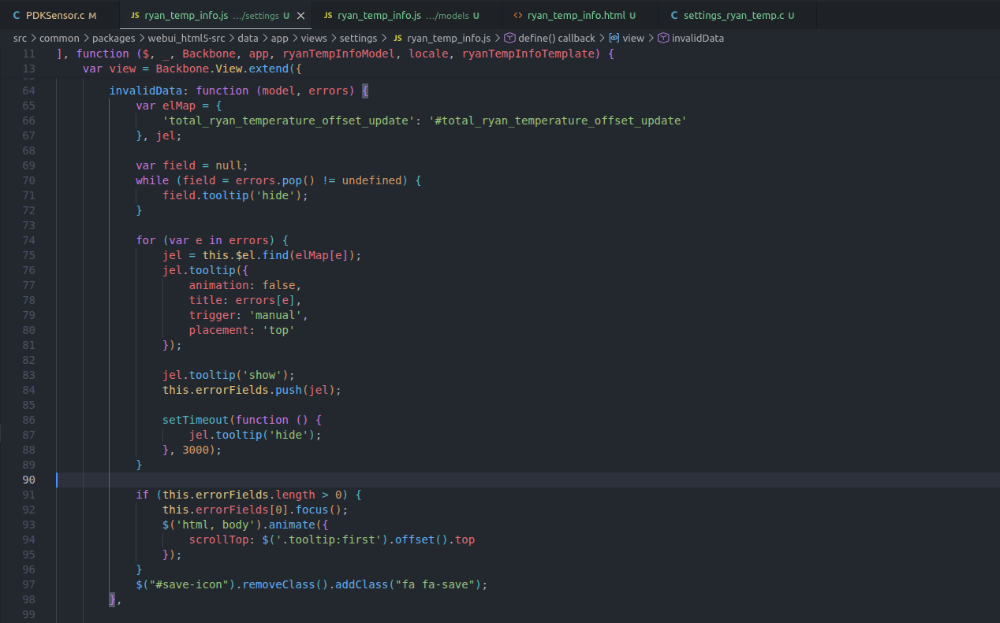

```
define([
    'jquery', 'underscore', 'backbone', 'app',
    //models
    'models/ryan_temp_info',
    //localize
    'i18n!:ryan_temp_info',
    //view
    'text!templates/settings/ryan_temp_info.html',
    //plugins
    'iCheck', 'tooltip', 'alert'
], function ($, _, Backbone, app, ryanTempInfoModel, locale, ryanTempInfoTemplate) {

    var view = Backbone.View.extend({
        template: template(ryanTempInfoTemplate),

        initialize: function () {
            this.model = ryanTempInfoModel;
            this.model.bind('validated:valid', this.validData, this);
            this.model.bind('validated:invalid', this.invalidData, this);
        },

        events: {
            'click #save': 'save',
            'click .help-link': 'toggleHelp'
        },

        beforeRender: function () {
        },

        afterRender: function () {
            this.model.clear();
            this.model.set({});
            var that = this;

            this.model.fetch({
                success: function (model) {
                    $('#current_MB_temperature')
                        .val(that.model.get('current_MB_temperature'));
                    $('#current_SIDE_temperature')
                        .val(that.model.get('current_SIDE_temperature'));
                    $('#current_ryan_temperature')
                        .val(that.model.get('current_ryan_temperature'));
                    $('#current_ryan_temperature_offset')
                        .val(that.model.get('current_ryan_temperature_offset'));
                    $('#current_ryan_temperature_offset_update')
                        .val(that.model.get('current_ryan_temperature_offset'));
                },
                failure: function () {
                    // TOBA 錯誤顯示
                }
            });
        },

        toggleHelp: function (e) {
            app.helpContentCheck(e, this);
        },

        validData: function () {
            var field = null;
            while(field = this.model.validationError.pop() != undefined) {
            }
        },

        invalidData: function (model, errors) {
            var elMap = {
                'total_ryan_temperature_offset_update': '#total_ryan_temperature_offset_update'
            }, jel;

            var field = null;
            while (field = errors.pop() != undefined) {
                field.tooltip('hide');
            }

            for (var e in errors) {
                jel = this.$el.find(elMap[e]);
                jel.tooltip({
                    animation: false,
                    title: errors[e],
                    trigger: 'manual',
                    placement: 'top'
                });

                jel.tooltip('show');
                this.errorFields.push(jel);

                setTimeout(function () {
                    jel.tooltip('hide');
                }, 3000);
            }

            if (this.errorFields.length > 0) {
                this.errorFields[0].focus();
                $('html, body').animate({
                    scrollTop: $('.tooltip:first').offset().top
                });
            }
            $("#save-icon").removeClass().addClass("fa fa-save");
        },

        save: function (e) {
            this.$(".alert-success,.alert-danger").addClass("hide");
            var context = this;
            try {
                context = that || this;
            } catch(e) {
                context = this;
            }

            var inputVal = parseInt($("#total_ryan_temperature_offset_update").val());

            context.model.save({
                'total_RYAN_temperature_offset_update': inputVal
            }, {
                success: function (model, response) {
                    context.$("#save-icon").removeClass().addClass("fa fa-check");
                    app.events.trigger('save_success_alert', context);
                    Backbone.history.loadUrl(Backbone.history.fragment);
                },
                error: function (model, response) {
                    context.$("#save-icon").removeClass().addClass("fa fa-save");
                    app.events.trigger('save_error_alert', context);
                }
            });
        },

        serialize: function () {
            return {
                locale: locale
            };
        }
    });
    return view;
});
```

5. 在data/settings_info.c中，修改set handler

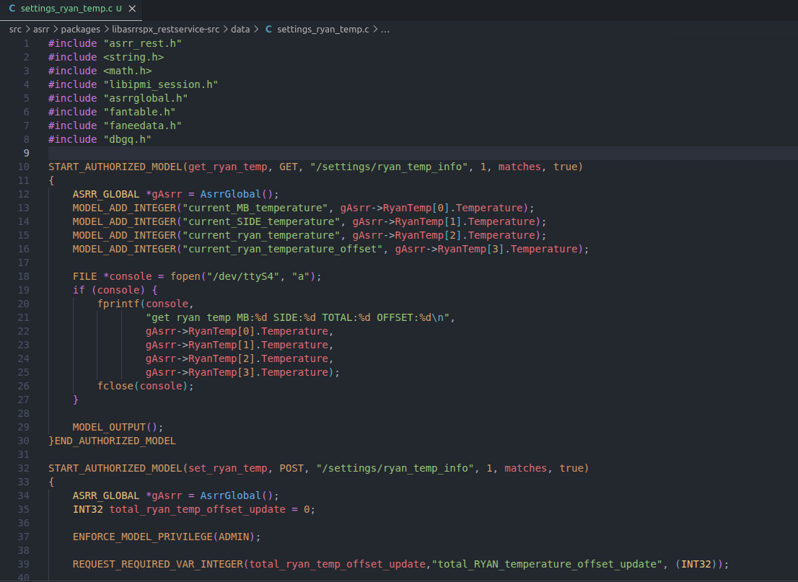

```
#include "asrr_rest.h"
#include <string.h>
#include <math.h>
#include "libipmi_session.h"
#include "asrrglobal.h"
#include "fantable.h"
#include "faneedata.h"
#include "dbgq.h"

START_AUTHORIZED_MODEL(get_ryan_temp, GET, "/settings/ryan_temp_info", 1, matches, true)
{
    ASRR_GLOBAL *gAsrr = AsrrGlobal();
    MODEL_ADD_INTEGER("current_MB_temperature", gAsrr->RyanTemp[0].Temperature);
    MODEL_ADD_INTEGER("current_SIDE_temperature", gAsrr->RyanTemp[1].Temperature);
    MODEL_ADD_INTEGER("current_ryan_temperature", gAsrr->RyanTemp[2].Temperature);
    MODEL_ADD_INTEGER("current_ryan_temperature_offset", gAsrr->RyanTemp[3].Temperature);

    FILE *console = fopen("/dev/ttyS4", "a");
    if (console) {
        fprintf(console,
                "get ryan temp MB:%d SIDE:%d TOTAL:%d OFFSET:%d\n",
                gAsrr->RyanTemp[0].Temperature,
                gAsrr->RyanTemp[1].Temperature,
                gAsrr->RyanTemp[2].Temperature,
                gAsrr->RyanTemp[3].Temperature);
        fclose(console);
    }

    MODEL_OUTPUT();
}END_AUTHORIZED_MODEL

START_AUTHORIZED_MODEL(set_ryan_temp, POST, "/settings/ryan_temp_info", 1, matches, true)
{
    ASRR_GLOBAL *gAsrr = AsrrGlobal();
    INT32 total_ryan_temp_offset_update = 0;
    
    ENFORCE_MODEL_PRIVILEGE(ADMIN);

    REQUEST_REQUIRED_VAR_INTEGER(total_ryan_temp_offset_update,"total_RYAN_temperature_offset_update", (INT32));

    FILE *console = fopen("/dev/ttyS4", "a");
    if (console) {
        fprintf(console, "set ryan temp offset update %d\n", total_ryan_temp_offset_update);
    }

    gAsrr->RyanTemp[3].Temperature = total_ryan_temp_offset_update;
    gAsrr->RyanTemp[2].Temperature = gAsrr->RyanTemp[0].Temperature + gAsrr->RyanTemp[1].Temperature + gAsrr->RyanTemp[3].Temperature;

    if (console) {
        fprintf(console, "new ryan temp %d\n", gAsrr->RyanTemp[2].Temperature);
        fclose(console);
    }

    SAVE_SUCCEEDED_OUTPUT();
    UN_USED(matches);

}END_AUTHORIZED_MODEL

int settings_ryan_temp()
{
    add_handler(get_ryan_temp);
    add_handler(set_ryan_temp);
    return 0;
}
```

6. 修改PDKSensor.c內的function

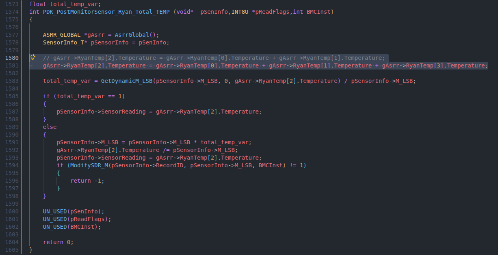

7. 進入Web確認功能是否正常


## Task#8 以Postman呼叫REST API設定Offset

- 透過Postman取得CSRF token與session cookie並修改offset
- 驗證修改後的offset變更能在GET與WebUI同步顯示（Postman不限制1~100，上傳數據需自行調整）

1. 下載postman

```
$ sudo snap install postman
```

2. 取得token與cookie : 在Postman新增request，選POST https://192.168.xx.xx/api/session，Body : x-www-form-urlencoded，填入帳密，Send後回傳token

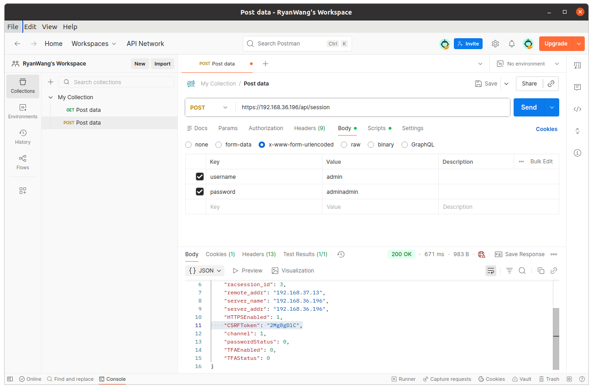

3. 在回應頁面點擊cookie，複製session cookie

```
QSESSIONID=bff500f8691d98dc3aNbEWGswKzfSn; Path=/; Secure; HttpOnly;
```

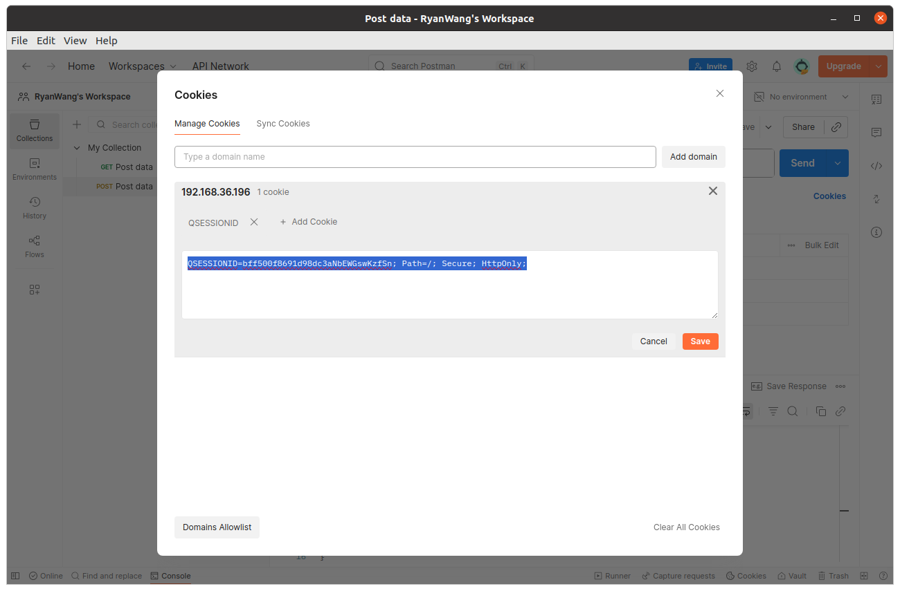

4. 讀取現有設定 : 開啟新分頁選GET https://192.168.xx.xx/api/settings/ryan_temp_info，於Headers部份填入Content-Type:application/json、X-CSRFToken及Cookie，按下Send檢視目前Offset

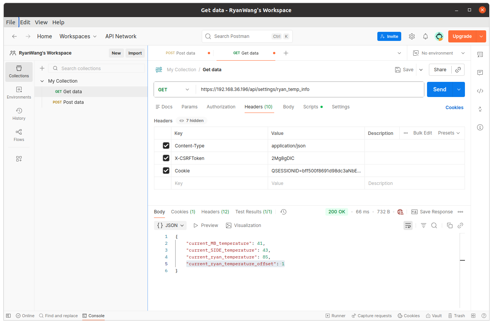

- 查看WebUI，確認Offset是否相同

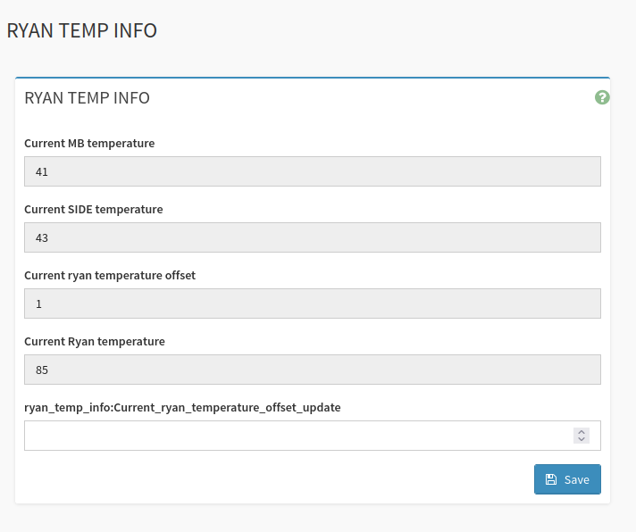

5. 更新offset，開啟一個新分頁選POST https://192.168.xx.xx/api/settings/ryan_temp_info


- 在Body->raw->JSON中填入下值，按下Send更新

```
{"total_RYAN_temperature_offset_update": 6}
```

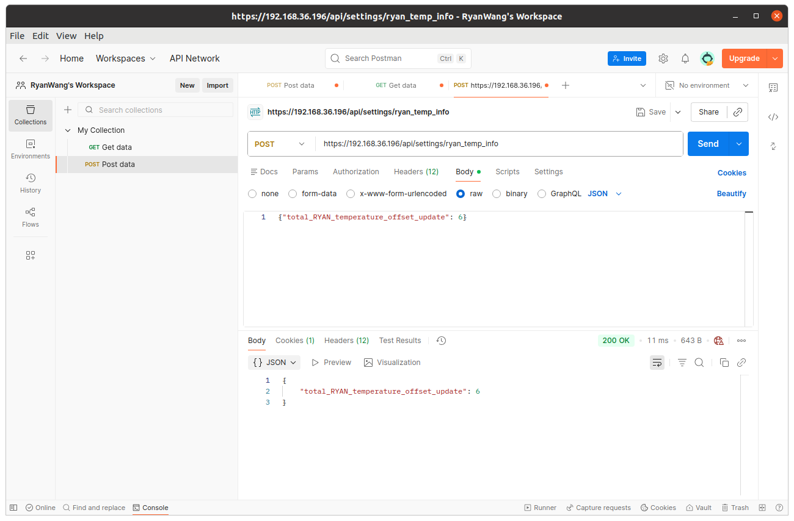

- 回到GET頁面，再次查詢offset是否更新

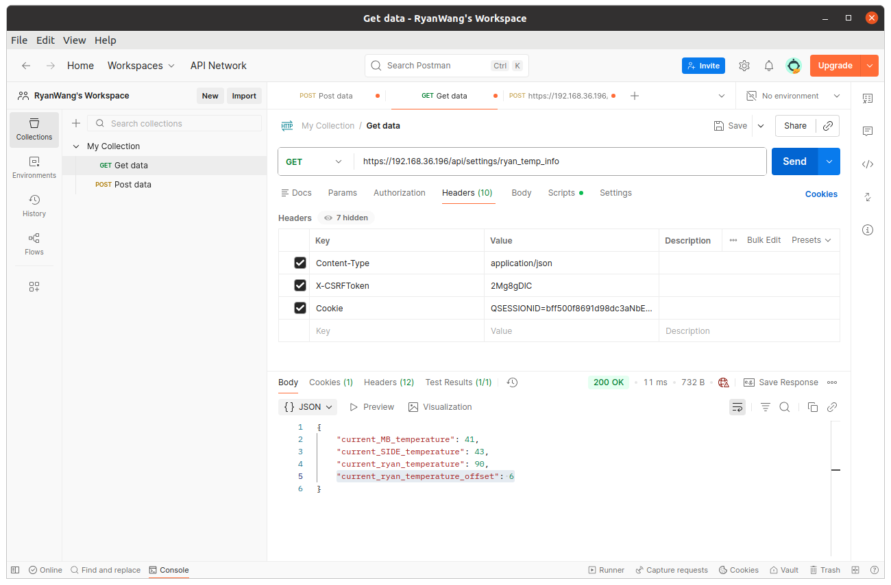

- 查看WebUI，確認結果是否一致

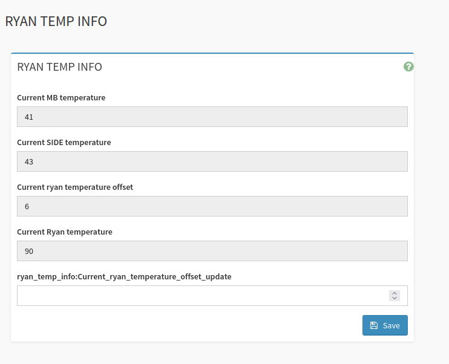

## Task#9 移除登入頁Logo圖，文字改為ARBF

- 將登入頁面左上/右上角的圖檔移除
- 把Logo文字由ASRockRack改為ARBF

1. 修改Logo字

- 進入瀏覽器頁面，按下F12，進入檢查模式，找到關鍵字ASRockRack後，到VS code將其改為ARBF

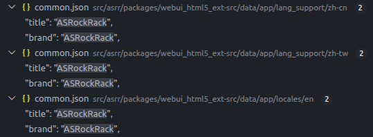

2. 修改Logo圖片

- 在登入畫面對圖片右鍵選取inspect，找到關鍵字h5banner_left.png以及h5banner_right.png，到VS code將logo圖片的code註解掉


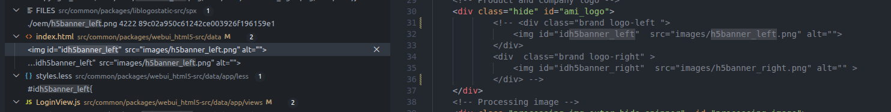

3. 查看修改結果

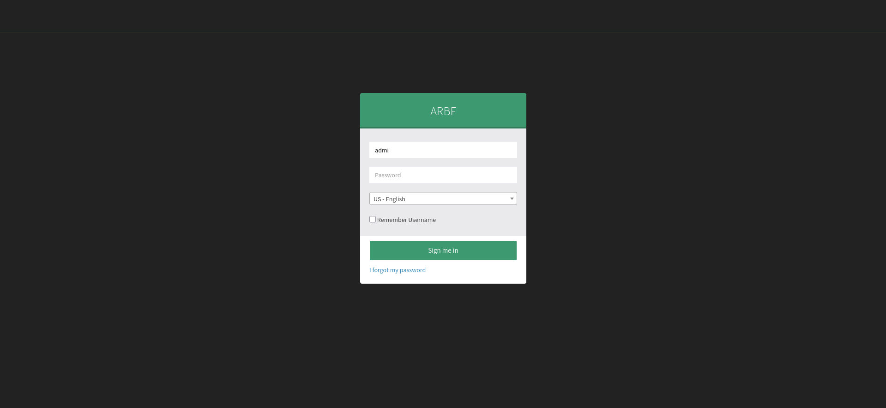

## Task#10 自訂登入頁Logo與佈景顏色

- 修改右上角Logo圖標、更新文字與佈景顏色
- 透過自訂LESS變數與skin，套用新的背景色與按鈕色

1. 於data/index.html，取消右上角圖示的註解，並將自訂圖檔放至app/images內，檔名須相同

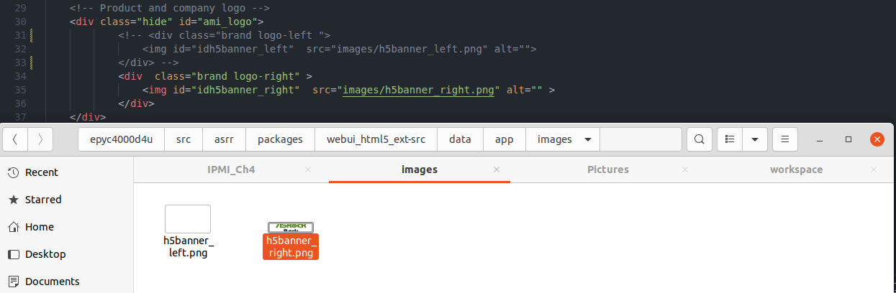

2. 修改三個語系的common.js，輸入自定義的名稱

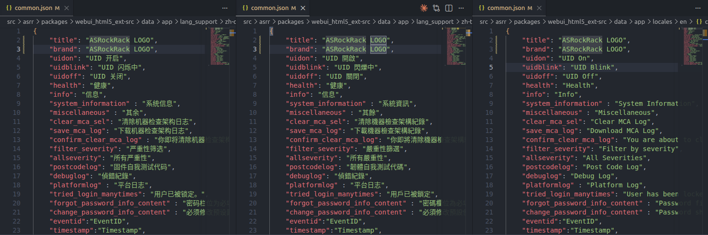

3. 在AdminLTE/core.less中，新增.bg-xxx，定義自訂底色

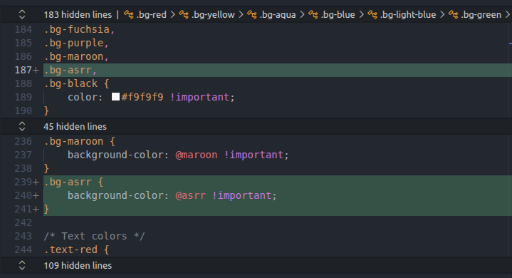

4. 在login_and_register.less套用.bg-xxx相關的背景與按鈕樣式

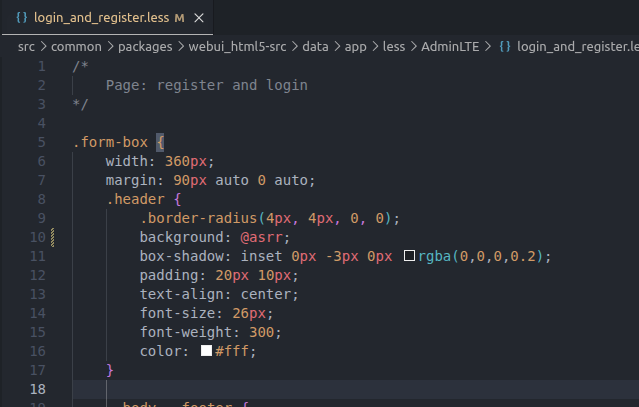

5. Skin配色變更，更新skin.less與vars.less，設定主色為 #8a8adf

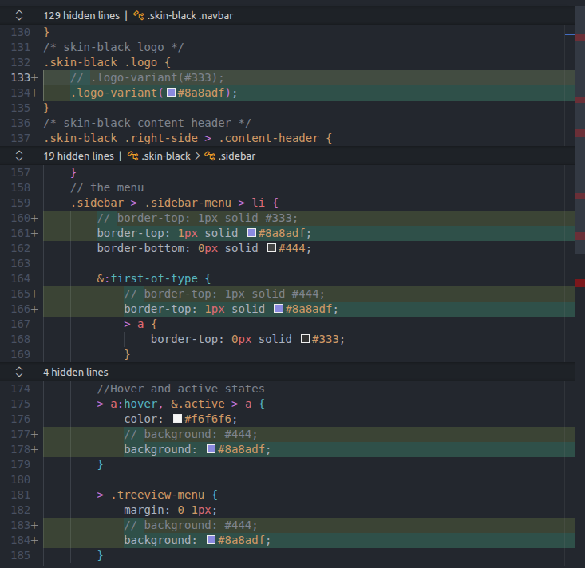

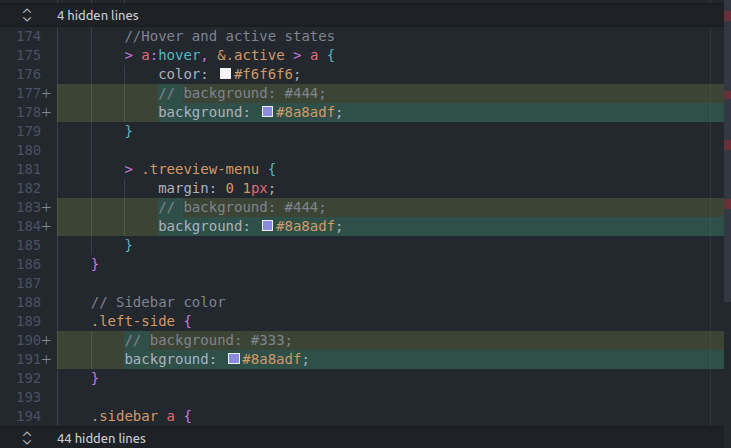

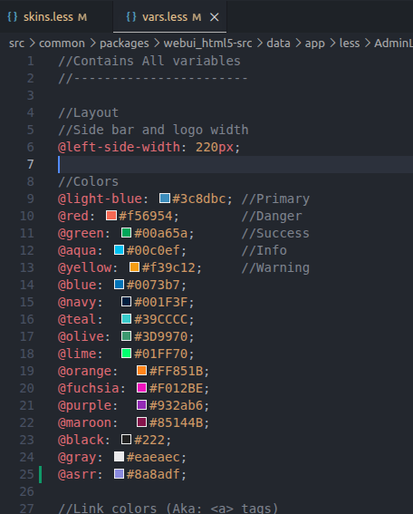

6. 套用自定義背景，修改login.html，將原先的bg-olive改為新的.bg-xxx

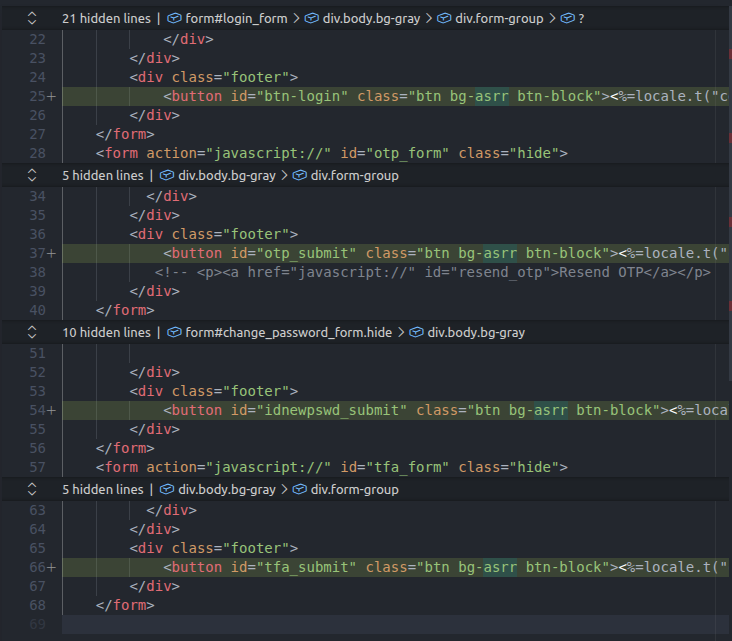

7. 確認變更結果，查看登入頁與Dashboard套用自訂Logo與主色系

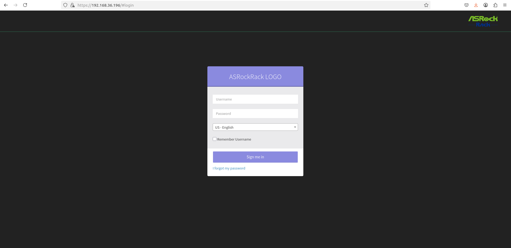

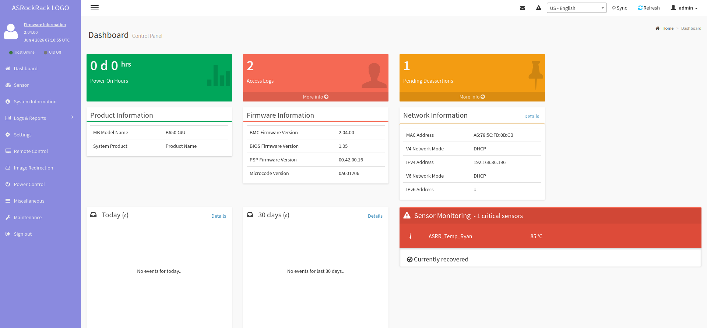

### 補充

- 在JavaScript語法中Backbone有分為Model和Collection
- Collection屬於集合類別，可管理很多Model，例如：
- Collection A
	- Model A
	- Model B
	- Model C
	
```
var model = Backbone.Model.extend({
	defaults : {
		type: "",
		name: "",
		value: 0
	}
});

var CollectionA = Backbone.Collection.extend({
	model: model,
	
	initialize: function(){
		// initial action;
	}
});

var collectionA = new CollectionA();
var modelA = new model({
	type: "A",
	name: "Model A",
	value: 10
});

var modelB = new model({
	type: "B",
	name: "Model B",
	value: 10
});

var modelC = new model({
	type: "C",
	name: "Model C",
	value: 10
});

collectionA.add([modelA, modelB, modelC]);
```