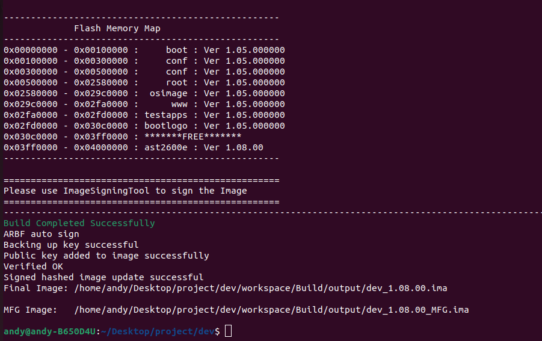
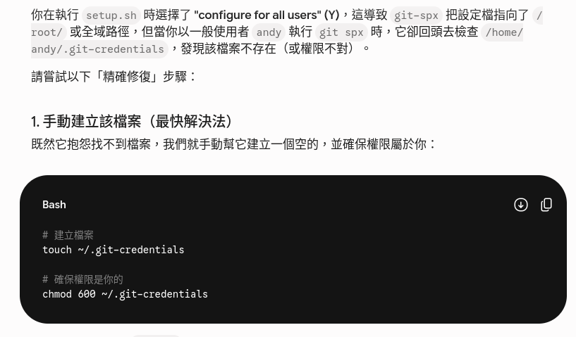

# Git SPX installation 安裝過程

## Docker 安裝

### step1 安裝docker的環境

```bash
$ sudo sudo apt-get remove docker docker-engine docker.io
```
再安裝
```bash
sudo sudo apt install docker.io
```
### step2 啟動docker的環境

第一句指令是為了啟動docker，第二句為了將 Docker 設為開機自動啟動。
```bash
$ sudo systemctl start docker

$ sudo systemctl enable docker
```

### step3 建立環境
```bash
$ sudo usermod -aG docker [Username]

$ newgrp docker
```

---

## 安裝git-spx套件

連到此連結後輸入公司外網帳號密碼
```bash
$ git clone http://192.168.36.8/BMC/tool/git-spx-plugin/v1.0-beta9.4.git
```
進入下載好的資料夾中使用以下指令強至安裝
```bash
$ sudo ./setup.sh -f
```
## 安裝 Auto_sign Key

連到此連結後輸入公司外網帳號密碼
```bash
$ git clone http://192.168.36.8/BMC/tool/autosign.git
```
進入下載好的資料夾中使用以下指令強至安裝
```bash
$ sudo ./apply_git-spx.sh
```

## 最後用這個驗證是否安裝成功
```bash
$ git spx buildsrc --updateprj ./configs/dev.PRJ ./packages ./workspace
```
最終結果


請確認最終有出現兩個ima檔案，才說明autosign 有成功運行

## 遇到的bug
### 遇到安裝完 git spx 後執行git spx 出現以下錯誤

顯示沒有.git-credentials
```bash
 ☓ .git-credentials missing or corrupted, Kindly uninstall and re-run the setup. Refer getting-started-guide.html for troubleshooting 
 ```

### 解決方案
可以參考下圖的解決方案
