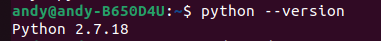
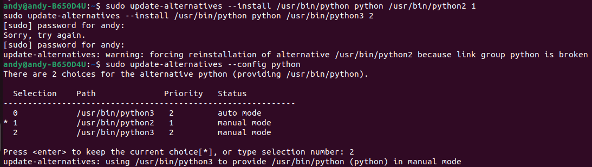
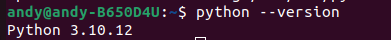

# 事先說明
## 1. 下載所需要的檔案

從對應連接使用 git clone 指令下載

## 2. 確認以何種方式 Build


### Use git spx build :
如果我們今天想用 git spx 去 build code，檔案類型需要是 .c / .h，因此若檔案類型目前是 .spx 則需下列步驟    
(如果原本就是.c or .h檔則不須此步驟)

1. 將 localcode/AST2500/xxxxxxx/packages 的檔案(.spx檔) extract 成 ./source-package(.c or .h檔)  

    白話一點就是將 packages 封包 (xxx-src.spx) 解壓縮成一個 source 資料夾 (裡面有 .c / .h)

    `$ sudo git spx extract ./packages/ ./source-package`
  

若檔案是 .c / .h後以 git spx build code，此段指令會生成 spx-packages-links 以及 workspace 去 build code  
    `$ sudo git spx buildsrc --updateprj ./configs/dev.PRJ ./packages ./workspace`  

指令說明:  
1. git spx buildsrc : 會去呼叫 BuildPRJ.py，他負責解析 .PRJ 專案設定 / 準備 source tree / 建立 package 對應關係 / 產生可編譯的 workspace / 驅動後續的 source build
2. --updateprj : 檢查 .PRJ 理定義的 packages / versions / platform，若有異動則去更新 projdef.h / projdef.mk
3. xxxx.PRJ : 這個檔案是整個專案的藍圖，他決定了專案的名稱、平台、使用那些 SPX packages，也就是說沒有此檔案 buildsrc 會不知道要 build 什麼
4. source-package : 原始來源庫
5. workspace : 真正發生編譯的地方

# Pyhon版本切換

如果系統中有多個python 版本可以用以下方式進行切換

## 先確認python版本
可以看到下圖為python2的版本



## 切換方式
使用指令

```bash
sudo update-alternatives --install /usr/bin/python python /usr/bin/python2 1
sudo update-alternatives --install /usr/bin/python python /usr/bin/python3 2
```

再執行切換指令
```bash
sudo update-alternatives --config python
```
執行此指令會看到下圖的畫面並進行選擇，選2(想要切換的數字)


再確認 python 指令後就可發現更改成功



# 範例
以下是各項 building 範例

## MDS 13.7

(需在 Python3.8 / Oracle Java8 環境下操作，以下範例使用 dev)

### MDS

1. 此處以 git spx build code (ast2600 code 使用 git-spx build)  
    `$ sudo git spx buildsrc --updateprj ./configs/dev.PRJ ./packages ./workspace`  

2. 到 ./MDS13.7/Linux/x86_64 底下先執行 install.sh  
    `$ sudo bash ./install.sh`

3. 到 ./MDS13.7/Linux/x86_64/MDS 下開啟 MDS  
    `$ sudo ./mds.sh`

4. 開啟後，右上角找到 Open Perspective 選取 SPX Builder，接著上方工具列找到 SPX 選取 Python Interpreter，選取 Python 3.8

5. 於 MDS 中左上角File ⇒ New ⇒ SPX project

6. select PRJ File 選擇 ./code/localcode/AST2600/dev3/configs/dev3.PRJ

7. Package Folder 選擇 ./code/localcode/AST2600/dev3/spx-packages-links

8. 選 Create a new development folder

    按下Finish，如有少sentry_sdk套件，執行以下指令，注意此處須為 Python3 版本

    `$ sudo pip3 install sentry-sdk`

## MDS 13.0.1 

(需在 Python2 / Oracle Java8 / LuaJIT-2.0.5 環境下操作，以下範例使用 ROME2D32GM-2T)

### Localcode改檔
如果我們今天想用 git spx 去 build code，檔案類型需要是 .c / .h，因此若檔案類型目前是 .spx 則需下列步驟    
(如果原本就是.c or .h檔則不須此步驟)

1. 將 localcode/AST2500/rome2d32gm-2t/packages 的檔案(.spx檔)轉成 ./source-package(.c or .h檔)  
    `$ sudo git spx extract ./packages/ ./source-package`

2. 生成 spx-packages-links  
    `$ sudo git spx configure ./configs/ROME2D32GM-2T.PRJ ./source-package`

### MDS

1. 到 ./MDS-13.0.1/Linux/x86_64 底下先執行 install.sh  
    `$ sudo bash ./install.sh`  

1. 到 ./mds-13.0.1/Linux/x86_64/MDS開啟MDS

    `$ sudo mds.sh`

2. 於 MDS 中左上角 File ⇒ New ⇒ SPX project

3. select PRJ File 選擇 ./code/localcode/AST2500/rome2d32gm-2t/configs/ROME2D32GM-2T.PRJ

4. Package Folder 選擇 ./code/localcode/AST2500/rome2d32gm-2t/spx-packages-links

5. 選 Create a new development folder

6. Build code base，於 ROME2D32GM-2T 按右鍵 ⇒ rebuild


## MDS 12.2 Building 

(需在 Python2 / Oracle Java8環境下操作，以下範例使用 EPC621D8A)

### MDS

1. 到 ./MDS-12.2/Linux/x86_64 底下先執行 install.sh  
    `$ sudo bash ./install.sh`

1. 到 ./MDS-12.2/Linux/x86_64/MDS 開啟 MDS  
    `$ sudo ./mds.sh`

2. 切換模式，在圖片裡右上方的位置有四個圖示，選擇右二 SPX Builder
    
3. 於 MDS 中左上角 File ⇒ New ⇒ SPX project

4. select PRJ File 選擇 ./code/localcode/2500/EPC621D8A/configs/EPC621D8A.PRJ

5. Package Folder 選擇 ./code/localcode/2500/EPC621D8A/packages

6. 選 Create a new development folder

7. 按下 Finish，如有少 sentry_sdk 套件，執行以下指令，注意此處須為 Python2 版本

    `$ sudo pip install sentry_sdk`

7. Build code base，於EPC2C621D8A按右鍵 ⇒ rebuild

